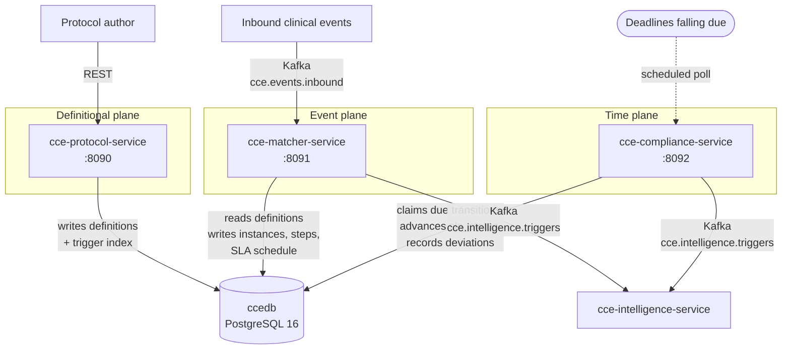
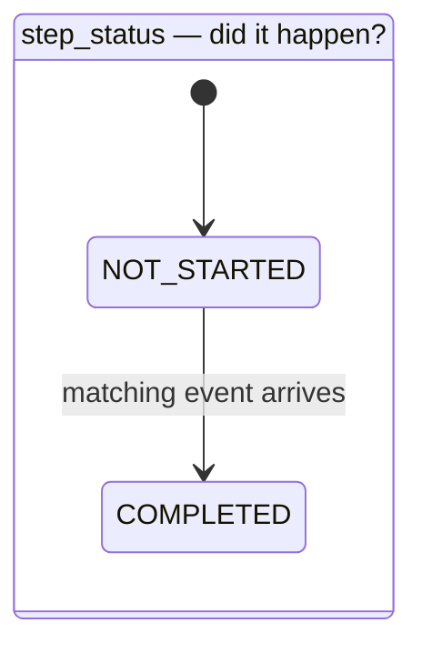
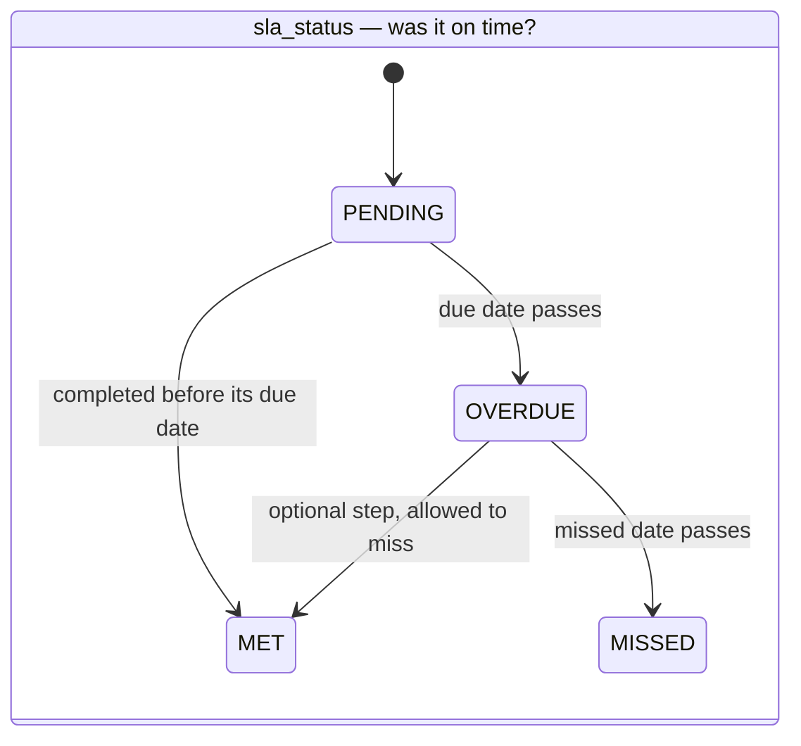

# Architecture Overview — CCE Services

> How the four repositories divide the work, and the contracts that hold between them.

This document is the shared context. Each service repository documents its own internals; none of
them restates what is here.

| Repository | Responsibility |
|---|---|
| **cce-protocol-service** | The definitional plane. Loads FHIR PlanDefinitions and ActivityDefinitions, builds the trigger index. |
| **cce-matcher-service** | The event plane. Matches inbound clinical events, enrols patients, creates and completes steps. |
| **cce-compliance-service** | The time plane. Applies SLA transitions as deadlines pass, records the resulting deviations. |
| **cce-common-util** | This library. Shared entities, repositories, FHIR parsing, and the services that operate on them. |

---

## 1. Why the split

The three planes have different shapes, and merging them meant every one of them got the wrong
deployment.

**Definitions change rarely and by human action.** A protocol is published, reviewed, retired.
Throughput is measured in loads per month. This plane wants a small, tightly-audited surface with
write access to definitional tables and no clinical traffic.

**Events arrive continuously and unpredictably.** Inbound volume tracks clinic activity, so the
event plane needs to scale horizontally with Kafka partitions and hold no state between records. It
is latency-sensitive: a clinician is often waiting on the other end.

**Time passes at a constant rate.** SLA deadlines fall due whether or not any event arrives, so
this plane is a scheduled sweep over a due-work table. It scales with the *backlog*, not with
inbound traffic, and a burst of clinical events must not delay it — nor it them.

A single deployment had to be sized for the union of all three, and any one of them could stall the
others. Splitting them lets each scale, fail and deploy on its own terms.

### What is deliberately not split

The **database** is shared (`ccedb`) rather than one per service. Splitting it would put a network
hop and an eventual-consistency window between `step_instance` and the `deviation` rows that
reference it, and the reporting queries that join them are the product. Instead the boundary is
enforced by column ownership — see
[Data Dictionary §3](data-dictionary.md#3-ownership).

The **persistence layer** is shared through this library rather than duplicated per service. An
earlier arrangement kept JPA out of common-util on the theory that entities are a service's private
business; the result was ~550 lines of identical entity and repository code in three repos, drifting
independently. A column added in one place and missed in another is a production failure, so the
entities live here once.

---

## 2. Service topology

There is no synchronous call between the three services, and no Kafka hop between them either. They
coordinate entirely through `ccedb`: the Protocol Service writes rows the Matcher Service reads, and
the Matcher Service writes the `step_sla_state_transition` rows the Compliance Service claims. This
is deliberate — a request-response dependency between them would mean an inbound clinical event
could fail because the definitional plane was restarting.

---

## 3. The intelligence trigger

Both the Matcher and Compliance services publish to `cce.intelligence.triggers`, because both can
be the proximate cause of an intelligence action: the Matcher when a step completes or an
`ORDER_VIOLATION` is detected, the Compliance Service when a deadline passes. The evaluation logic
is identical, so it lives here once
([`IntelligenceActionEvaluator`](library-reference.md#intelligenceactionevaluator)) and both
services drive it.

Publication is confirmed rather than fire-and-forget: the producer waits for the broker
acknowledgement and records the outcome on the `intelligence_event_log` row. A trigger the broker
never acknowledged stays marked unpublished and is replayable, rather than being lost while the
clinical work that caused it commits regardless.

---

## 4. Step status and SLA status

Two independent facts about a step, in two columns:

- **`step_status`** — did the expected event arrive? `NOT_STARTED` → `COMPLETED`.
- **`sla_status`** — was the deadline met? `PENDING` → `OVERDUE` → `MISSED`, or `MET`.

These were once a single `state` column plus a `completion_status`, which could not represent
"completed, but late" without inventing composite states, and forced two services to write the same
column. Splitting them means the pair reads directly: `COMPLETED` + `MISSED` is late work that got
done, `NOT_STARTED` + `MISSED` is work that did not. `completion_status` was dropped because
early-versus-late is derivable from the pair.

`PENDING` and the former `DUE` meant the same thing, so `DUE` is gone. Tolerance now affects only
the transition to `MISSED`.

Ownership: the Matcher Service writes `step_status`; the Compliance Service writes `sla_status` as
deadlines pass, and the Matcher Service settles it once at completion. Neither writes the other's
column. See [Data Dictionary §3](data-dictionary.md#3-ownership).

---

## 5. SLA transition contract

The Matcher Service knows a step's deadlines the moment it creates the step; the Compliance Service
must act on them later, without polling every step in the database. The `step_sla_state_transition`
table is that handoff — one row per threshold, inserted at step creation, carrying the time it
becomes actionable.

**Matcher inserts. Compliance claims.** A row is claimed with `FOR UPDATE SKIP LOCKED`, which is
what lets every Compliance replica poll the same table concurrently: a row locked by one replica is
invisible to the others rather than contended. There is no lease table, no heartbeat and no leader
election — the row lock *is* the claim, held for the length of the transaction that applies it. A
replica that dies mid-batch releases its locks on connection loss and the work is immediately
claimable again.

Claim and apply happen in **one** transaction. Claiming in one and applying in another would leave a
window where a row is marked taken but not yet acted on, which is exactly the state a crash makes
permanent.

What the applier does depends on the step it finds, because the event may have arrived between the
row being scheduled and the deadline falling due:

| Step state when the transition fires | Action |
|---|---|
| `NOT_STARTED` | advance `sla_status`, record the deviation |
| `COMPLETED`, `completed_at >= process_by` | leave `sla_status` (Matcher already settled it), record the deviation — the work was late |
| `COMPLETED`, `completed_at < process_by` | consume the row and do nothing — the event beat the deadline |

An optional step (`could`) that misses its deadline resolves to `MET` with no deviation: nothing was
required, so nothing was breached. The applier never writes `step_status`.

A row that fails is retried with exponential backoff (`2^attempts`, capped), not discarded.

---

## 6. Deployment order

**Protocol → Matcher → Compliance**, following the migration ownership in
[Data Dictionary §3](data-dictionary.md#3-ownership). Matcher's migration declares foreign keys into
tables the Protocol Service creates, and the Compliance Service validates its JPA mapping at
startup against tables both of the others created — it will fail fast rather than start against a
schema that cannot serve it.

Each service's own deployment steps are in its repository's deployment guide.

---

## 7. Where to look next

| For | See |
|---|---|
| Column-level schema, enums, JSONB shapes | [Data Dictionary](data-dictionary.md) |
| What this library provides, package by package | [Library Reference](library-reference.md) |
| `relatedAction` direction, status vocabularies, trigger model | [FHIR Conformance](fhir-conformance.md) |
| Building against or contributing to this library | [Developer Setup](developer-setup.md) |
| Matching algorithm, enrolment, step lifecycle | Matcher Service repo |
| Definition loading and trigger index construction | Protocol Service repo |
| SLA sweep internals and tuning | Compliance Service repo |
