# Care Coordination Engine — Architecture, Data & Security

**A C4-model description of the CCE product, the data it holds, how it is secured, and how it is deployed for the Rwanda Ministry of Health.**

| | |
|---|---|
| **Document version** | 1.0 |
| **Prepared** | 2026-09-08 |
| **Audience** | Customer technical stakeholders, security reviewers, MoH technical support |
| **Product** | OpenPHC Care Coordination Engine (CCE) |
| **Software release described** | **2.0.0** |
| **Deployment described** | Rwanda MoH — `cce.moh.gov.rw` (production), `cceuat.moh.gov.rw` (UAT) |

---

## How to read this document

The description follows the **C4 model** — four nested levels of abstraction, each one zooming into the previous:

| Level | Question it answers | Section |
|---|---|---|
| **1 — System Context** | Who uses CCE, and what does it talk to? | [§2](#2-c4-level-1--system-context) |
| **2 — Containers** | What separately deployable/runnable things make up CCE? | [§3](#3-c4-level-2--containers) |
| **3 — Components** | What are the major parts inside each container? | [§4](#4-c4-level-3--components) |
| **4 — Code** | How is a component implemented? | [§5](#5-c4-level-4--code) |

Two cross-cutting views follow the C4 levels, because they are what most reviewers actually need:

- **[§6 — Data: what is stored, where, and how](#6-data--what-is-stored-where-and-how)**
- **[§7 — Security](#7-security)**

The final section, **[§8 — Rwanda production deployment](#8-rwanda-production-deployment)**, describes the physical deployment as handed over.

### Which release this describes

**This document describes CCE release 2.0.0 throughout** — the architecture, data model and services described in §2–§7 are the ones being deployed to Rwanda. There is no second architecture to hold in mind while reading.

Release 2.0.0 organises the compliance logic as three services split along the axis of what drives each one — definitions, events, and time. [§3.2](#32-why-the-compliance-logic-is-split-into-three-planes) explains why that boundary falls where it does.

**[§8](#8-rwanda-production-deployment) describes the Rwanda deployment** — the environment, the services and their deployment order, how the platform is operated, and a verification checklist to work through once it is live.

---

## 1. What CCE is

The Care Coordination Engine is an **event observer and care coordinator** for health systems. It sits *alongside* existing systems rather than replacing them: it watches clinical events, checks them against expected care pathways, and raises intelligence when something is missed.

The problem it addresses is not a shortage of data but a shortage of coordination. Care events sit siloed in CHW apps, facility EMRs, labs and registries; missed steps go unnoticed; handoffs break down silently between systems.

### The three things it does

| Capability | What it means |
|---|---|
| **TRACK** — Journey | Every step of a patient's care across all connected systems — visits, referrals, labs, immunizations. |
| **COMPARE** — Protocol | Automatically compares what happened against what *should* have happened, per the defined care protocol. |
| **ACT** — Intelligence | Alerts for missed visits, reminders before deadlines, supervisor escalations, cross-system task routing. *(Detection is live in Rwanda; outbound delivery is a later phase — see the scope note below.)* |

**A worked example.** A high-risk pregnancy is enrolled on Day 0 and a referral raised on Day 1. If no appointment event arrives by Day 5, CCE raises a `referral_pending_alert`; by Day 8 it escalates to a supervisor. When the appointment completes on Day 10 the referral loop is closed and logged as three days late. Without CCE, that referral expires silently and nobody knows.

> **Scope note — what is live in Rwanda today.** TRACK and COMPARE are fully live: events are ingested, matched against protocols, and every deviation is detected, recorded and surfaced in the analytics dashboard. **ACT is partially live.** CCE *detects* the conditions that warrant an alert and records them, but **it does not yet deliver anything to an external system** — no SMS, no EMR task, no supervisor notification. In the example above, CCE would record the pending referral and the escalation-worthy delay, and show both in the dashboard; a supervisor learns of it by looking, not by being told. Outbound delivery is planned for a later phase ([§8.8](#88-known-items)).

### Design principle — CCE acts, systems decide

CCE generates *intelligence events* — alerts, tasks, escalations. Each participating system decides whether and how to respond. CCE coordinates; it does not control.

> **Operationally this means: CCE never writes into a source EMR.** It is a read-only observer of clinical activity plus a publisher of advisory events. This is the single most important fact for a security or clinical-safety review.

### Standards it is built on

| Standard | Used for |
|---|---|
| **CloudEvents v1.0** | The event envelope every inbound event is wrapped in |
| **FHIR R4** | Clinical payloads — Encounter, Observation, ServiceRequest, Consent, MedicationRequest |
| **FHIR PlanDefinition** | Care protocols expressed as a standard resource |
| **FHIR ActivityDefinition** | Intelligence actions (what CCE does when a rule fires) |
| **OAuth 2.0 / OIDC** | Authentication and authorization, via Keycloak |

CCE is built entirely on **open-source components** — no proprietary runtime dependency, no vendor lock-in.

---

## 2. C4 Level 1 — System Context

At the highest level, CCE is one system with three classes of neighbour: the **source systems** that generate clinical events, the **people** who consume its analytics, and the **target systems** that receive its intelligence.

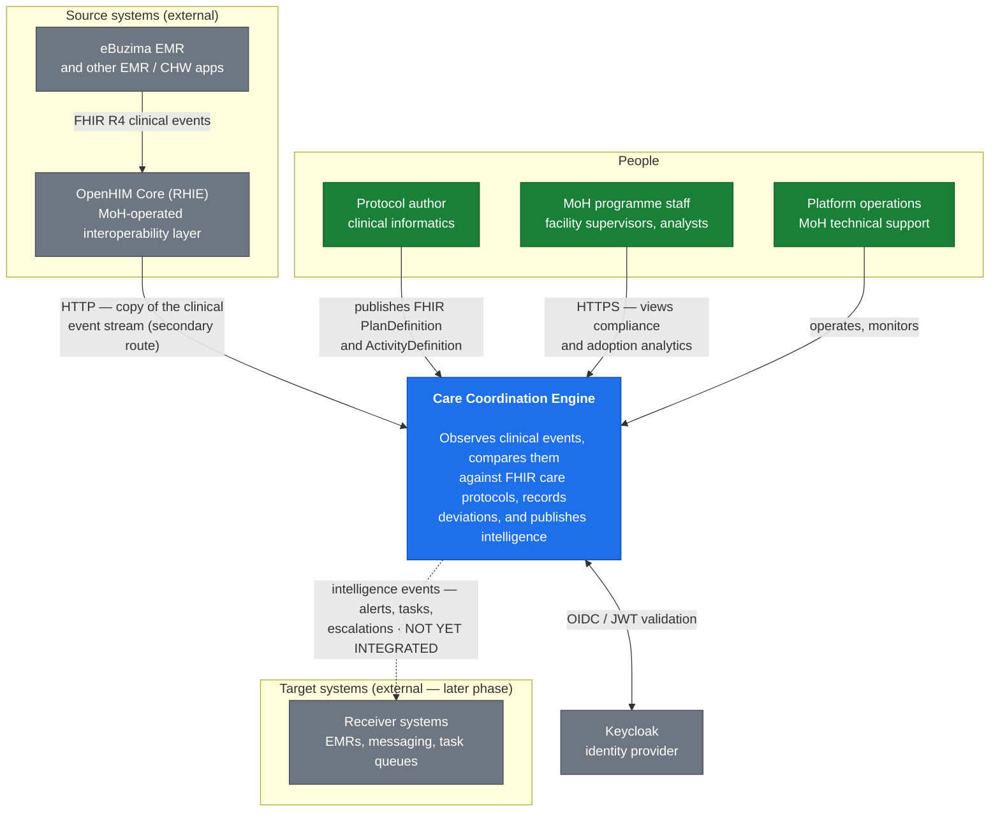

### Actors and neighbours

| Actor / system | Relationship to CCE | Direction |
|---|---|---|
| **eBuzima EMR** | The source of all live clinical events in Rwanda. CCE never writes to it. | Inbound only |
| **OpenHIM Core (RHIE)** | MoH-operated interoperability layer. CCE receives a *copy* of the clinical event stream via a **secondary route** on an existing channel, authenticating to the CCE gateway with HTTP Basic. CCE is never on the primary clinical path, so a CCE outage cannot affect clinical service delivery. | Inbound only |
| **Protocol author** | Publishes versioned FHIR PlanDefinition / ActivityDefinition resources that define what "correct care" means. | Inbound (write) |
| **MoH programme staff** | Consume compliance, adoption, deviation and referral analytics through a browser dashboard. | Outbound (read) |
| **Platform operations** | Deploy, monitor, back up and troubleshoot the platform. | Operational |
| **Receiver systems** | Would consume CCE intelligence events and decide how to act. **No integration exists today** — this is planned for a later phase. | Outbound (not yet active) |
| **Keycloak** | Issues and signs the tokens that authorize every human and machine caller. | Bidirectional |

### Phase status in Rwanda

| Phase | Scope | Status |
|---|---|---|
| **Phase 1 — Compliance** | Emitter adaptor, event ingestion, protocol matching, SLA tracking, deviation detection, analytics dashboard | **Live — this is what the deployment delivers today** |
| **Later phase — Intelligence delivery** | Receiver adaptors, automated alerts, cross-system task routing | **Not in use.** `cce-intelligence-service` is deployed but no downstream integration exists; see [§8.8](#88-known-items) |

---

## 3. C4 Level 2 — Containers

A *container* in C4 is a separately deployable or runnable thing — an application process, a database, a message broker. CCE is composed of **nine application containers**, **three data stores** and **one message broker**, arranged in four planes.

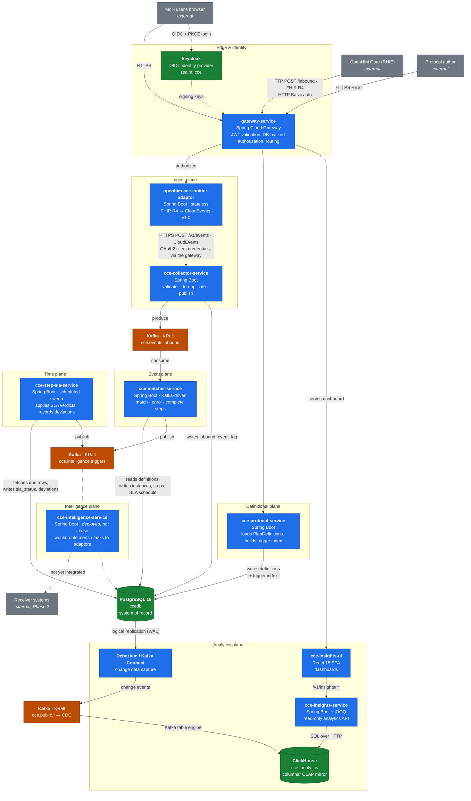

### 3.1 Container catalogue

#### Application containers

| Container | Technology | Responsibility | Persists to | Speaks |
|---|---|---|---|---|
| **openhim-cce-emitter-adaptor** | Spring Boot 3.4, Java 21, HAPI FHIR 7.4 | OpenHIM mediator. Receives FHIR R4 resources forwarded by the gateway from a secondary OpenHIM route, wraps each in a CloudEvents v1.0 envelope, forwards to the Collector. Registers itself with OpenHIM Core and heartbeats. | **Nothing — fully stateless** | HTTP in, HTTP out |
| **cce-collector-service** | Spring Boot 3.4, Java 21 | The **single point of entry** for clinical events. Validates the CloudEvents envelope and FHIR payload, de-duplicates, applies server-side defaults, publishes to Kafka. No external system publishes to Kafka directly. | `ccedb.inbound_event_log` | HTTP in, Kafka out |
| **cce-protocol-service** | Spring Boot 3.4, Java 21 | The **definitional plane**. Accepts and validates FHIR PlanDefinition / ActivityDefinition, derives the trigger index, manages definition lifecycle. Traffic measured in loads per month. | `protocol_definition`, `action_definition`, `trigger_index` | HTTP in, SQL |
| **cce-matcher-service** | Spring Boot 3.4, Java 21 | The **event plane**. Consumes clinical events, matches them against protocol triggers (two-tier), enrols patients, creates and completes steps, schedules SLA thresholds, detects order violations. **No REST API** — driven entirely by Kafka. | `protocol_instance`, `step_instance`, `step_sla_state_transition`, `deviation`, `matcher_event_log`, `facility`, history tables | Kafka in/out, SQL |
| **cce-step-sla-service** | Spring Boot 3.4, Java 21 | The **time plane**. A scheduled sweep that picks up SLA threshold rows as they fall due, writes the SLA verdict, records `OVERDUE` / `MISSED` deviations, and publishes the intelligence they trigger. Creates **no tables**. | `step_instance.sla_status`, `deviation`, `intelligence_event_log` (writes only) | HTTP (read-only API) out, Kafka out, SQL |
| **cce-intelligence-service** | Spring Boot 3.4, Java 21 | **Deployed but not in use.** Its role is to consume intelligence triggers, resolve the delivery target and routing, dispatch to receiver adaptors and record the outcome — none of which is active, because no downstream integration exists yet. | `intelligence_delivery`, `receiver_adaptor`, `destination_adaptor_mapping` — **all unused today** | Kafka in, HTTP out, SQL |
| **cce-insights-service** | Spring Boot 3.4, Java 21, jOOQ | **Read-only** analytics API — 33+ REST endpoints over compliance, adoption, deviation, referral, event-volume and ingestion metrics. Never writes. Three-tier in-memory cache. | Nothing (read-only) | HTTP in, ClickHouse SQL out |
| **cce-insights-ui** | React 18, TypeScript, Vite 6, Tailwind 4 | Browser SPA rendering the analytics dashboards. Read-only. | Browser only | HTTPS |
| **gateway-service** | Spring Boot 3.5, Spring Cloud Gateway | Single ingress for authenticated traffic. Validates JWTs against Keycloak, enforces route-level permissions loaded from a database table, routes to backends. | `api_permissions` (reads) | HTTPS |

#### Infrastructure containers

| Container | Technology | Role |
|---|---|---|
| **PostgreSQL** | PostgreSQL 16 | `ccedb` — **the system of record** for all compliance state. Also hosts the `keycloak` database. |
| **Apache Kafka** | Kafka 3.7+ / cp-kafka 7.6, KRaft mode | Event backbone. Carries the clinical event stream, the intelligence trigger stream, and the CDC change stream. |
| **Debezium on Kafka Connect** | Debezium 3.0, `pgoutput` plugin | Reads the PostgreSQL WAL via logical replication and publishes one change-event topic per table. |
| **ClickHouse** | ClickHouse 26.3 LTS | `cce_analytics` — the **derived analytics mirror**. Columnar OLAP store, populated only by CDC. |
| **Keycloak** | Keycloak 26.5 | OIDC identity provider. Realm `cce`. |

### 3.2 Why the compliance logic is split into three planes

The three planes have genuinely different shapes, and merging them meant every one of them got the wrong deployment:

- **Definitions change rarely and by human action.** A protocol is published, reviewed, retired. This plane wants a small, tightly-audited surface with write access to definitional tables and no clinical traffic.
- **Events arrive continuously and unpredictably.** Inbound volume tracks clinic activity, so the event plane must scale horizontally with Kafka partitions and hold no state between records. It is latency-sensitive.
- **Time passes at a constant rate.** SLA deadlines fall due whether or not any event arrives. This plane scales with the *backlog*, not with inbound traffic — and a burst of clinical events must not delay it, nor it them.

A single deployment had to be sized for the union of all three, and any one of them could stall the others.

### 3.3 What is deliberately *not* split

**The database is shared** (`ccedb`) rather than one per service. Splitting it would put a network hop and an eventual-consistency window between `step_instance` and the `deviation` rows that reference it — and the reporting queries that join them are the product. Instead the boundary is enforced by **column ownership**: exactly one service runs the DDL for a table, and exactly one service writes any given column. See [§6.3](#table-ownership--who-writes-what).

**The persistence layer is shared** through the `cce-common-util` library rather than duplicated per service, so a column added in one place cannot be missed in another.

### 3.4 How the services coordinate

There is **no synchronous call between the three compliance services, and no Kafka hop between them either.** They coordinate entirely through `ccedb`:

- The Protocol Service writes rows the Matcher Service reads.
- The Matcher Service writes `step_sla_state_transition` rows the Step SLA Service fetches.

This is deliberate: a request-response dependency between them would mean an inbound clinical event could fail because the definitional plane was restarting.

**Deployment order is therefore fixed: Protocol → Matcher → Step SLA.** Matcher's migration declares foreign keys into tables the Protocol Service creates, and the Step SLA Service validates its mapping at startup and fails fast rather than starting against a schema that cannot serve it.

---

## 4. C4 Level 3 — Components

This level opens up the containers that carry the most logic. Containers that are thin by design — the emitter adaptor, the UI, the gateway — are summarised rather than diagrammed.

### 4.1 cce-collector-service — the front door

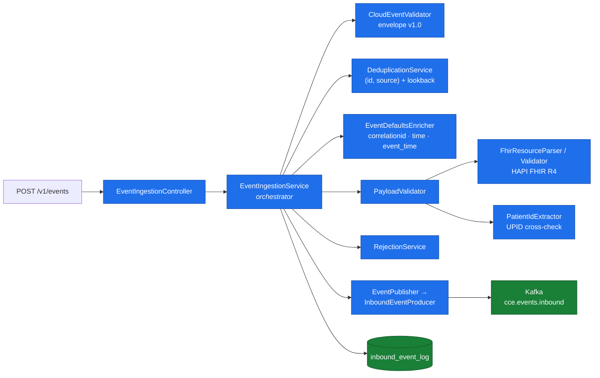

**Processing pipeline, in order:**

1. **Receive** HTTP POST, parse body.
2. **Validate the CloudEvents envelope** — `specversion` must be `1.0`; `id`, `source`, `type`, `subject`, `data`, `datacontenttype` must all be present. `subject` (the patient UPID) is mandatory: CCE cannot route an event without it.
3. **De-duplicate** on `(cloudevents_id, source)` within a configurable lookback window (default 30 days). A repeat returns **200 OK with `status: "duplicate"`** and is *not* republished — the standard idempotent-POST contract OpenHIM mediators expect.
4. **Persist the raw request as-is** to `inbound_event_log` (status `RECEIVED`) *before* any processing. This is the audit trail.
5. **Apply server-side defaults** — generate `correlationid` if absent; fill `time` from server receipt time if absent; derive `event_time` (the *clinical occurrence time*) from the FHIR payload, falling back to the envelope `time`, then to receipt time.
6. **Validate the payload.** For `application/fhir+json`: parse via HAPI FHIR, confirm a recognised R4 `resourceType`, and **cross-check the patient UPID in the resource against the envelope `subject`** — a mismatch is rejected. For `application/json`: JSON validity only. Anything else is rejected.
7. **Publish to Kafka synchronously**, keyed by `subject` so all events for one patient stay in order on one partition.
8. **Record the outcome** on `inbound_event_log` — `ACCEPTED`, `REJECTED` (with a reason code and error detail), or `DUPLICATE`.

> **No outbox, no dead-letter topic.** If the Kafka publish fails the Collector returns HTTP 500 and marks the event `REJECTED / KAFKA_PUBLISH_FAILURE`; the source system retries per its own policy. Rejections are monitored through the database and a Prometheus counter tagged by reason.

**Constraints:** max payload 1 MB; max event id 50 characters; publish timeout 30 s.

### 4.2 cce-protocol-service — the definitional plane

Everything this service does is arranged so that *runtime* is cheap. A definition is parsed, validated and indexed **once, at load**; the Matcher then matches events with an index lookup rather than by interpreting FHIR on the hot path. That makes load-time validation the only place a broken definition can be caught, so the loader **rejects rather than warns** wherever a definition could not possibly work.

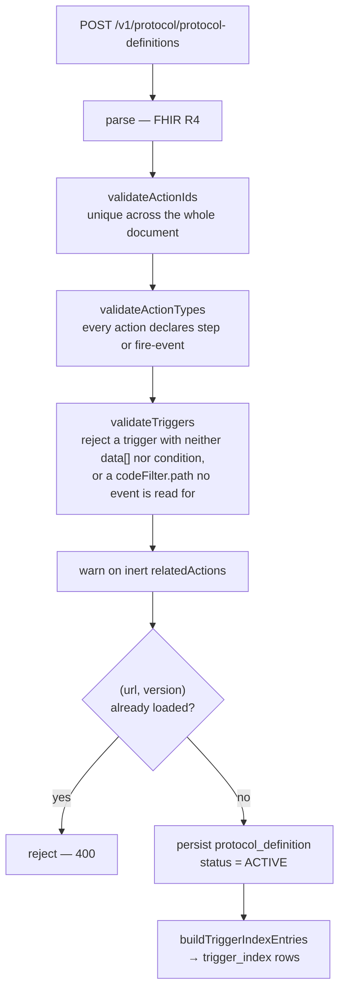

Validation happens **before** the duplicate check and before any write, so a malformed definition never leaves a partial row behind.

| Condition | Outcome | Why |
|---|---|---|
| Duplicate action id | reject | Sub-steps are flattened to peers, so ids must be unique document-wide |
| Missing / unknown action type | reject | An untyped action cannot be classified |
| Trigger with neither `data[]` nor `condition` | reject | Matches nothing — an action that can never fire |
| Unknown FHIR resource type in a trigger | reject | Would create an index row no event could match |
| `codeFilter.path` outside the nine readable paths | reject | Every codeFilter of an action must match, so one bad path silently disables the whole action |
| `concurrent-*` or dangling `relatedAction` | **warn** | Establishes no ordering; inert at runtime |

### 4.3 cce-matcher-service — the event plane

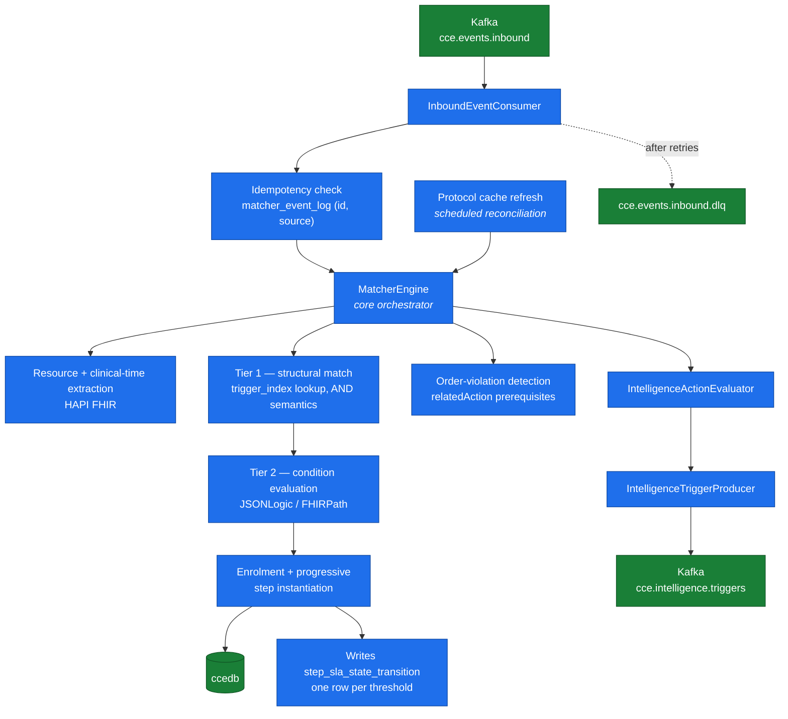

**Two-tier matching.** Tier 1 is a single indexed SQL lookup against `trigger_index`, decomposed at protocol-load time into `(resourceType, path, codeSystem, codeValue)` tuples, with `GROUP BY … HAVING` enforcing AND semantics across an action's code filters. Tier 2 evaluates optional JSONLogic/FHIRPath conditions in process. Condition-only triggers (no `data[]`) are held in memory and evaluated per event.

**Clinical time, not ingestion time.** The Matcher resolves each event's *clinical occurrence time* from the FHIR payload, falling back to the envelope, then to now. `enrolled_at` and `completed_at` are clinical times — so a backdated or batch-uploaded event lands where it clinically belongs, and ingestion lag never shifts a compliance number. Unmapped and unparseable clinical-time fields are counted as metrics rather than silently swallowed.

**Scheduling, not judging.** When the Matcher creates a step, it writes one `step_sla_state_transition` row per threshold **in the same transaction**, so a step never exists without its schedule. It never writes `sla_status`.

### 4.4 cce-step-sla-service — the time plane

This service owns everything driven by *time passing*:

1. Fetch the `step_sla_state_transition` rows the Matcher scheduled, once they come round, and reach the verdict each one stands for — a breached deadline, or a completion recorded on time.
2. Write `step_instance.sla_status` — `OVERDUE`, `MISSED` and `MET` all from (1). **It is the only writer of that column.**
3. Record the resulting `OVERDUE` / `MISSED` deviations. On-time work breached nothing and records none.
4. Evaluate and publish the intelligence those deviations trigger.

**The fetch protocol.** A row is fetched under `FOR UPDATE SKIP LOCKED`, which is what lets every replica poll the same table concurrently: a row locked by one replica is invisible to the others rather than contended. There is **no lease table, no heartbeat and no leader election** — the row lock *is* the reservation, held for the length of the transaction that applies it. A replica that dies mid-batch releases its locks on connection loss and the work becomes immediately available again. Fetch and apply happen in **one** transaction, so a crash cannot leave a row marked taken but unacted-on.

**The verdict depends on the step, not on when the sweep runs.** The applier compares `step_instance.completed_at` against the row's immutable `process_by` and never consults the wall clock. A row deferred by a failure and applied late therefore reaches exactly the verdict it would have reached on time.

| Row | Step when applied | `sla_status` | Deviation |
|---|---|---|---|
| `DUE_DATE_REACHED` | not completed | `OVERDUE` | `OVERDUE` |
| `DUE_DATE_REACHED` | `completed_at >= process_by` | `OVERDUE` | `OVERDUE` |
| `DUE_DATE_REACHED` | `completed_at < process_by` | *unchanged* | — |
| `MISSED_DATE_REACHED` | not completed | `MISSED` (`must` only) | `MISSED` (`must` only) |
| `MISSED_DATE_REACHED` | `completed_at >= process_by` | `MISSED` (`must` only) | `MISSED` (`must` only) |
| `MISSED_DATE_REACHED` | `completed_at < process_by` | *unchanged* | — |

**On-time work does not wait for its deadline.** Matcher writes a `MET_CONDITION_REACHED` row the moment a completing event lands before the step's `due_date`, with `process_by` set to that `completed_at` — so the row is already due and the Step SLA Service records `MET` on its next cycle (seconds), not when a deadline weeks away arrives. One table, one loop, every verdict.

**Writes are forward-only.** `MET` and `MISSED` are settled outcomes, and `OVERDUE` never replaces `MISSED` — which is what a retry applying two rows out of order would otherwise do. Failed rows are retried with exponential backoff (`2^attempts`, capped), never discarded.

**Optional steps.** Only mandatory steps have deadlines. Matcher schedules no transition row for an optional step and the Protocol Service rejects a protocol that gives one a `tolerance-days`, so an optional step takes neither `OVERDUE` nor `MISSED` — nothing was required of it, so there is nothing for it to breach. A row for one predates those rules and is consumed, recording nothing.

### 4.5 The two-status model — the heart of the data model

Two independent facts about a step, in two columns. This is the single most important modelling decision in CCE and it shapes every downstream analytic.

| Column | Question | Written by | Values |
|---|---|---|---|
| `step_status` | **Did the expected event arrive?** | Matcher only | `NOT_STARTED` → `COMPLETED` |
| `sla_status` | **Was the deadline met?** | Step SLA only | *null* → `OVERDUE` → `MISSED`, or *null* → `MET` |

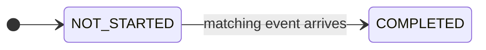

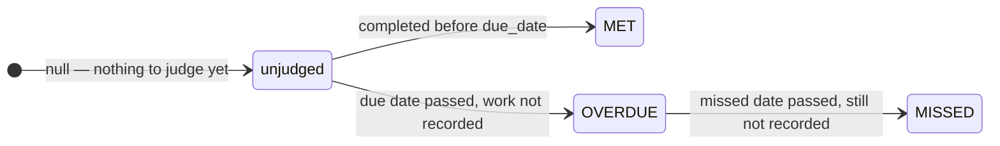

**Reading the pair:**

| `step_status` | `sla_status` | Meaning |
|---|---|---|
| `COMPLETED` | `MET` | Recorded on time |
| `COMPLETED` | `OVERDUE` | Recorded late, before being written off |
| `COMPLETED` | `MISSED` | Recorded after being written off |
| `NOT_STARTED` | *(null)* / `OVERDUE` | Still outstanding |
| `NOT_STARTED` | `MISSED` | Never recorded; deviation raised |

`sla_status` has **no initial enum value** — the column is nullable and null means *there is nothing to judge yet*. Null is also the permanent state of a step with no due date. Saying "unjudged" with an enum constant would make the absence of a judgement look like one that had been made.

### 4.6 cce-insights-service — the analytics API

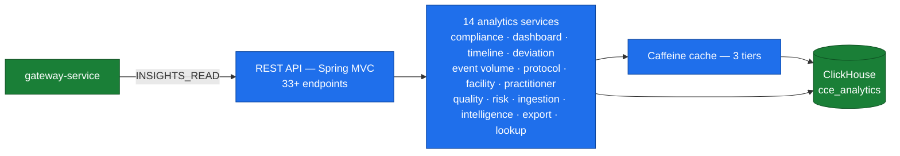

**Read-only by construction.** The service never issues `INSERT`, `UPDATE` or `DELETE`. It uses jOOQ for type-safe SQL against the live ClickHouse schema — no ORM, no entity manager, no transactions.

**Three cache tiers** (Caffeine, in-process, TTL-configurable):

| Cache | Default TTL | Max entries | Contents |
|---|---|---|---|
| `lookups` | 60 min | 50 | Dropdown filter data — protocols, facilities, practitioners, sources |
| `analytics` | 30 min | 200 | Compliance summaries, protocol analytics, deviation analytics, patient risk |
| `metrics` | 15 min | 500 | Event volume, ingestion pipeline, processing quality |

**Two clocks, chosen by metric type** — this matters when reconciling numbers:

- **Functional / clinical metrics** (adoption, compliance, deviations, event volume, referrals, patient cohorts) are measured on **clinical `event_time`** — when the act actually happened. Ingestion lag, offline sync, batch upload and replay never shift these numbers.
- **Technical / operational metrics** (the Ingestion page only) are measured on **processing time** (`received_at`).

> Rule of thumb: *"when did it happen clinically?"* → `event_time`; *"when did our system handle it?"* → `received_at`. Every page is clinical **except** Ingestion.

### 4.7 cce-insights-ui — the dashboard

A React 18 + TypeScript SPA served as static assets. Read-only; it holds no data beyond the browser session.

- **Login** is OIDC Authorization Code with **PKCE (S256)** against Keycloak, run *before* the app renders, so an unauthenticated user never sees a frame of the application.
- The access token is refreshed on a background interval and attached as `Authorization: Bearer …` to every API call.
- Authentication is a **build-time** flag (`VITE_AUTH_ENABLED`). The same image runs gateway-less for local development or fully authenticated in production. **Production builds must have it enabled.**

### 4.8 gateway-service — the policy enforcement point

The gateway is the only container exposed to end users and the only place authorization decisions are made.

| Step | What happens |
|---|---|
| 1 | Extract credentials from `Authorization`. Bearer JWT is the primary path. |
| 2 | Validate the JWT against the Keycloak realm — signature, issuer (`JWT_ISSUER`), audience (`gateway-service`), expiry. |
| 3 | Read the caller's roles from `resource_access.gateway-service.roles`. |
| 4 | Match the request's HTTP method and URI against the `api_permissions` table, which maps a permission name to a method + URI pattern (e.g. `INSIGHTS_READ` → `GET /v1/insights/**`). |
| 5 | Route to the backend, or reject with 401 / 403. |

Permissions live in a **database table rather than YAML**, so they can be changed without redeploying the gateway and are shared across gateway replicas.

**HTTP Basic path — used in production by OpenHIM.** OpenHIM channels can send only Basic credentials, so the gateway accepts them on the inbound clinical route (`BASIC_AUTH_ENABLED=true`). It exchanges those credentials for a Keycloak token via the resource-owner-password grant and then runs the **identical** validation and authorization pipeline as a bearer token — so a Basic caller gets no weaker treatment than a JWT caller. Tokens are cached per credential until shortly before expiry, so the exchange does not add a Keycloak round-trip to every event.

The capability is deliberately isolated to a **dedicated confidential client** (`openhim-basic`) with Direct Access Grants enabled, separate from the bearer-only `gateway-service` client, which therefore keeps its tighter posture. Detail in [§7.4.3](#743-the-openhim-basic-auth-path).

### 4.9 The analytics pipeline

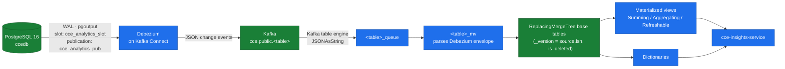

**Design principles:**

| Principle | Rationale |
|---|---|
| **Open-source only** | No vendor lock-in, no licence cost |
| **CDC-only (committed data)** | Analytics read only what PostgreSQL committed — no discrepancies from rolled-back transactions |
| **No custom stream processing** | ClickHouse MATERIALIZED columns and materialized views replace a Flink-style layer. Zero custom application code in the pipeline. |
| **Immutable append-only** | `ReplacingMergeTree` handles updates idempotently, versioned by WAL position |
| **Read-only observer** | **The pipeline never writes to CCE operational databases. Its failure cannot impact clinical services.** |

**Key invariant: PostgreSQL is authoritative; ClickHouse is derived.** If analytics look wrong, the fix is to rebuild the mirror — never to edit ClickHouse by hand.

---

## 5. C4 Level 4 — Code

The code level is not diagrammed here. In C4 practice it is generated on demand for the one component under discussion rather than maintained as documentation, and CCE's repositories carry that detail themselves.

Where to look:

| For | Repository | File |
|---|---|---|
| Shared entities, repositories, FHIR parsing, package-by-package reference | `cce-common-util` | `docs/library-reference.md` |
| Column-level schema, enums, JSONB shapes | `cce-common-util` | `docs/data-dictionary.md` |
| `relatedAction` direction, status vocabularies, trigger model | `cce-common-util` | `docs/fhir-conformance.md` |
| Matching algorithm, enrolment, step lifecycle | `cce-matcher-service` | `docs/architecture-overview.md` |
| Definition loading, trigger index construction | `cce-protocol-service` | `docs/architecture-overview.md` |
| SLA sweep internals and tuning | `cce-step-sla-service` | `docs/architecture-overview.md` |
| ClickHouse DDL, MV catalogue, dictionaries | `cce-data-pipeline` | `docs/data-flow.md`, `schema/01..09-*.sql` |

> **There are no OpenAPI / Swagger specifications anywhere in the platform.** The `api-reference.md` file in each repository is the authoritative API contract. This is a documented gap, not an oversight to work around.

---

## 6. Data — what is stored, where, and how

### 6.1 The short answer

CCE holds four kinds of data in four places:

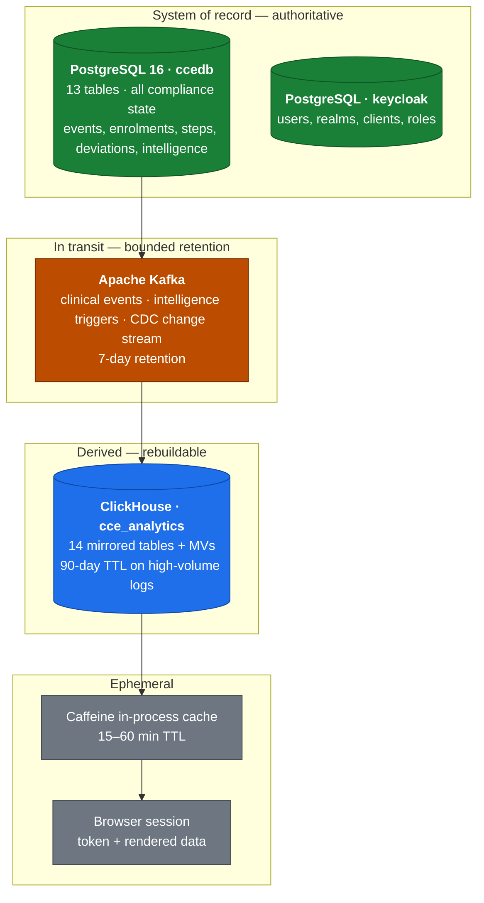

| Store | Role | Authoritative? | Rebuildable? |
|---|---|---|---|
| **PostgreSQL `ccedb`** | All compliance state | **Yes — system of record** | **No.** Irreplaceable. |
| **PostgreSQL `keycloak`** | Identity | **Yes** | **No.** Irreplaceable. |
| **Apache Kafka** | Event backbone, in flight | No — a buffer | Not needed; replayable within retention |
| **ClickHouse `cce_analytics`** | Analytics mirror | No — **derived** | **Yes**, fully, from PostgreSQL via replay |

> **The single most important operational consequence:** back up PostgreSQL. ClickHouse can be reconstructed from it in full; the ClickHouse dump exists to make recovery *faster*, not to make it *possible*.

### 6.2 What clinical data CCE actually holds

CCE is a compliance observer, so the data it keeps is deliberately narrow. Understanding what is *and is not* present matters for any privacy assessment.

| Category | Held? | Where | Notes |
|---|---|---|---|
| **Patient identifier (UPID)** | **Yes** | `protocol_instance.patient_id`, `intelligence_event_log.subject`, CloudEvent `subject`, and inside every raw payload | A **pseudonymous** programme identifier (e.g. `260115-0001-7823`), not a name |
| **Patient name, address, contact details** | Only if present in a source FHIR payload | `inbound_event_log.raw_payload`, `matcher_event_log.data` — verbatim, unparsed | CCE never *extracts*, *indexes* or *queries* these fields; they are retained as received for audit and replay |
| **Raw FHIR clinical payload** | **Yes, verbatim** | `inbound_event_log.raw_payload` (JSONB), mirrored to ClickHouse `inbound_event_logs.raw_payload` | The complete original request body, immutable. This is the largest concentration of clinical detail in the platform. |
| **Facility identifier & name** | **Yes** | `facility` table; `facility_id` extracted from payloads | Auto-populated from inbound events; `district_name` and `expected_patients_per_day` set by programme staff |
| **Practitioner reference & display name** | **Yes** | Extracted at insert time into ClickHouse `inbound_event_logs.practitioner_ref` / `practitioner_display` | Used for practitioner-level analytics |
| **Compliance state** | **Yes** | `protocol_instance`, `step_instance`, `deviation`, history tables | The product's actual output — enrolments, steps, timing, verdicts |
| **Care protocol definitions** | **Yes** | `protocol_definition`, `action_definition` (JSONB) | Clinical logic, not patient data |
| **Clinical *notes* / free text** | Only insofar as a source payload contained it | `raw_payload` | Not parsed or surfaced |
| **Credentials of end users** | **No** | Held only by Keycloak | CCE services never see a password |
| **Financial / payment data** | **No** | — | Not in scope |

**Two properties worth stating plainly to any reviewer:**

1. **CCE is write-only towards source systems' data and read-only towards their systems.** It never issues a write to an EMR.
2. **Patient identifiers are pseudonymous.** The UPID is a programme identifier. Re-identification requires the source registry, which CCE does not hold.

### 6.3 PostgreSQL `ccedb` — the system of record

One database, shared by four services. Thirteen tables.

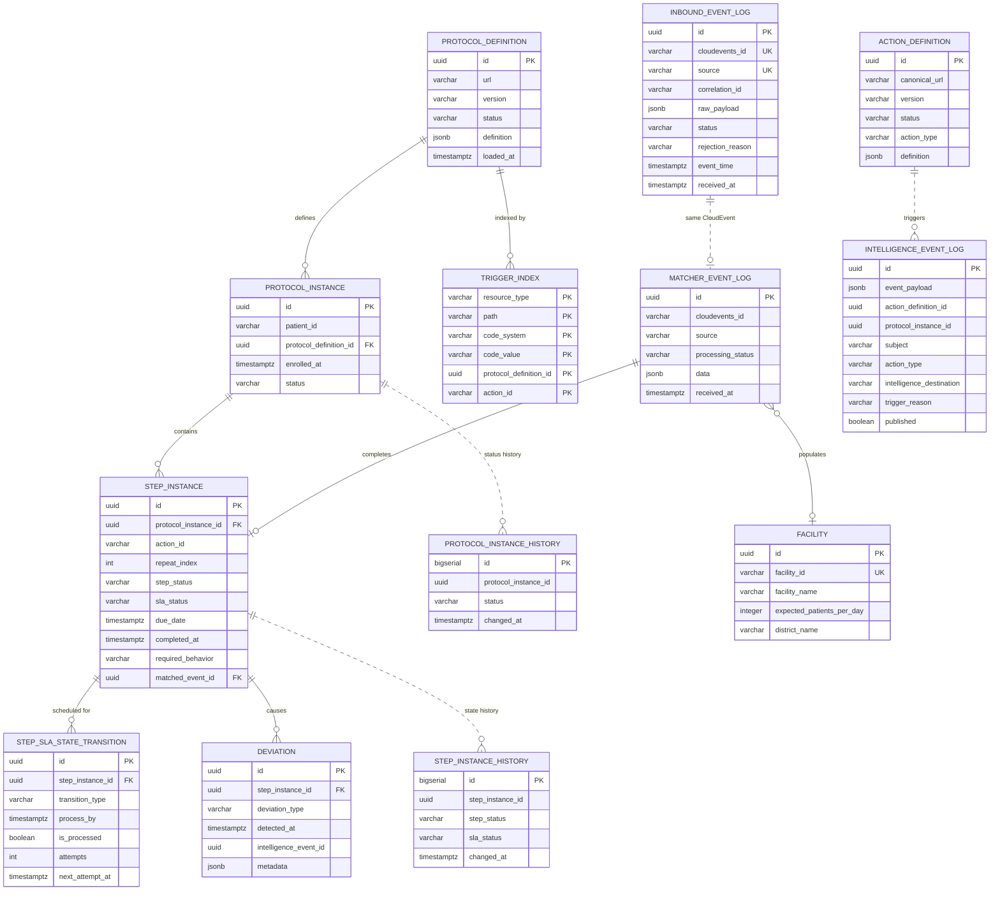

#### Table catalogue

| # | Table | What it holds | Row growth | Contains patient data? |
|---|---|---|---|---|
| 1 | `protocol_definition` | FHIR PlanDefinition resources — the protocol templates | Low (tens) | No |
| 2 | `action_definition` | FHIR ActivityDefinition resources — what an intelligence action does | Low (tens) | No |
| 3 | `trigger_index` | Inverted index for fast structural event matching | Low (per protocol load) | No |
| 4 | `protocol_instance` | A patient's enrolment in a protocol | Medium (per patient) | **UPID** |
| 5 | `step_instance` | An individual action occurrence in a patient's journey | Medium–High | Indirect (via FK) |
| 6 | `step_sla_state_transition` | Each step's SLA schedule — one row per threshold | Medium–High | Indirect |
| 7 | `deviation` | Recorded protocol deviations | Medium | Indirect |
| 8 | `intelligence_event_log` | Every intelligence action evaluated, with its context and published payload | Medium–High | **UPID + FHIR payload** |
| 9 | `protocol_instance_history` | Append-only log of every enrolment status transition | High | Indirect |
| 10 | `step_instance_history` | Append-only log of every step / SLA status transition | High | Indirect |
| 11 | `matcher_event_log` | Idempotency log of every inbound CloudEvent and its outcome | High (every event) | **FHIR `data` body** |
| 12 | `facility` | Reference registry of known facilities | Low | No |
| 13 | `inbound_event_log` | **Every** CloudEvent accepted or rejected, with its raw payload | High (every event) | **Full raw payload** |

#### Table ownership — who writes what

Two rules keep a shared database safe: **exactly one service runs the DDL for a table, and exactly one service writes any given column.**

| Table | Migration owner | Writers | Readers |
|---|---|---|---|
| `protocol_definition` | Protocol | Protocol | Matcher, Step SLA |
| `action_definition` | Protocol | Protocol | Matcher, Step SLA |
| `trigger_index` | Protocol | Protocol | Matcher |
| `protocol_instance` | Matcher | Matcher | Step SLA |
| `step_instance` | Matcher | Matcher, **Step SLA** (disjoint columns) | both |
| `step_sla_state_transition` | Matcher | Matcher (inserts), Step SLA (fetches) | both |
| `deviation` | Matcher | Matcher, Step SLA (append-only) | both |
| `intelligence_event_log` | Matcher | Matcher, Step SLA (append-only) | Step SLA |
| `protocol_instance_history` | Matcher | Matcher | — (CDC only) |
| `step_instance_history` | Matcher | Matcher, Step SLA (append-only) | — (CDC only) |
| `matcher_event_log` | Matcher | Matcher | Matcher |
| `facility` | Matcher | Matcher, **programme staff (direct SQL)** | Matcher |
| `inbound_event_log` | Collector | Collector | — (CDC only) |

**The one shared mutable table** is `step_instance`, and the split is by column:

| Column | Writer | Meaning |
|---|---|---|
| `step_status`, `completed_at` | **Matcher only** | Whether the expected event arrived, and when the act happened |
| `due_date` | **Matcher only** | Written once at step creation, never updated |
| `sla_status` | **Step SLA only** | Whether the deadline was met |

`facility` is the one table with a writer that is not a service: programme staff set `district_name` and `expected_patients_per_day` directly in the database, and no service touches those two columns.

#### How the data is stored — mechanics

| Mechanism | Where | Why |
|---|---|---|
| **UUID v7 primary keys** | `protocol_instance`, `step_instance`, `deviation`, `step_sla_state_transition`, `inbound_event_log` | Time-ordered, so rows sort by creation time and inserts get index locality |
| **JSONB for FHIR resources** | `protocol_definition.definition`, `action_definition.definition`, `inbound_event_log.raw_payload`, `matcher_event_log.data`, `deviation.metadata`, `intelligence_event_log.event_payload` / `evaluation_context` | Preserves the complete FHIR resource without a migration for every schema evolution |
| **Natural-key uniqueness for idempotency** | `inbound_event_log (cloudevents_id, source)`, `matcher_event_log (cloudevents_id, source)`, `deviation (step_instance_id, deviation_type)`, `step_sla_state_transition (step_instance_id, transition_type)` | Makes ingestion, deviation recording and SLA scheduling idempotent against retries and concurrent writers |
| **Partial indexes on the hot predicate** | `idx_sslt_due` (unprocessed rows), `idx_step_instance_not_started`, `idx_protocol_instance_status` | Keeps working sets scoped to pending work however large the retained history grows |
| **Append-only history tables** | `protocol_instance_history`, `step_instance_history` | Lifecycle columns are overwritten in place, so the prior value would otherwise be lost. Written inside the caller's transaction (`Propagation.MANDATORY`), so a transition and its record are atomic. |
| **Immutable audit columns** | `step_sla_state_transition.process_by`, `inbound_event_log.raw_payload` | `process_by` is the audit truth for when a deadline fell; `raw_payload` is the audit truth for what was received |
| **Separate Flyway ledgers** | `flyway_schema_history_protocol`, `flyway_schema_history_matcher` | So neither service's migration ledger sees the other's |

> **A caveat that matters for audit completeness.** History rows are written by the service layer inside the same transaction as the change they record. Out-of-band SQL `UPDATE`s are therefore **not** captured. Every lifecycle mutation must go through the service layer.

> **There is no `audit_log` table.** It was removed in 2.0.0: the append-only history tables carry state transitions, and actor attribution is planned to move onto the domain tables. **Consequence: a protocol load or retirement is currently traceable only through the application log, not through the database.** See [§7.7](#77-known-gaps-and-hardening-backlog).

### 6.4 Apache Kafka — data in transit

| Topic | Direction | Partitions | Key | Contents | Retention |
|---|---|---|---|---|---|
| `cce.events.inbound` | Collector → Matcher | 25 | `subject` (patient UPID) | Validated CloudEvents with full FHIR payload | **7 days** |
| `cce.events.inbound.dlq` | Matcher (failure) | 25 | `subject` | Events that failed processing after retries | 7 days |
| `cce.intelligence.triggers` | Matcher / Step SLA → Intelligence | 25 | — | `IntelligenceTriggerEvent` — patient UPID, action, severity, destination, original FHIR payload. **Produced today; no active consumer** while intelligence delivery is out of use | 7 days |
| `cce.public.<table>` (14 topics) | Debezium → ClickHouse | — | table PK | Row-level change events for every mirrored table | 7 days |

**Producer guarantees on the clinical stream:** `acks=all`, `enable.idempotence=true` (exactly-once within a partition), 3–5 retries, 32 MB producer buffer. Keying by patient UPID means all events for one patient land on one partition and are therefore processed in order.

**Kafka carries clinical payloads.** This is the reason Kafka is not exposed outside the platform network and the reason topic retention is bounded at 7 days.

**Confirmed publication, not fire-and-forget.** Intelligence triggers wait for the broker acknowledgement and record the outcome on the `intelligence_event_log` row. A trigger the broker never acknowledged stays marked unpublished and is replayable — `GET /v1/compliance/intelligence-events?published=false` lists exactly those replay candidates.

### 6.5 ClickHouse `cce_analytics` — the derived mirror

**How data gets there.** PostgreSQL logical replication (`pgoutput`) feeds a Debezium connector on a replication slot; Debezium publishes JSON change events to Kafka; ClickHouse consumes those topics *directly* through Kafka-engine queue tables into `ReplacingMergeTree` targets via consumer materialized views. **There is no ClickHouse sink connector and no S3 staging.**

| Component | Identity |
|---|---|
| Replication slot | `cce_analytics_slot` |
| Publication | `cce_analytics_pub` |
| Debezium connector | `cce-ccedb-source` |
| Snapshot mode | `initial` |
| Deletes | Carried as `op='d'`, not tombstones |

#### Mirrored tables

| Category | Source table in `ccedb` | Engine |
|---|---|---|
| Event logs | `inbound_event_log`, `matcher_event_log` | ReplacingMergeTree |
| Domain entities | `protocol_instance`, `step_instance`, `deviation` | ReplacingMergeTree |
| SLA schedule | `step_sla_state_transition` | ReplacingMergeTree |
| State history | `protocol_instance_history`, `step_instance_history` | ReplacingMergeTree (append-only) |
| Intelligence | `intelligence_event_log` · `intelligence_delivery` (unused today) | ReplacingMergeTree |
| Reference | `protocol_definition`, `action_definition`, `facility` | ReplacingMergeTree |
| Adaptor routing | `receiver_adaptor`, `destination_adaptor_mapping` (unused today) | ReplacingMergeTree |

> **The mirror tracks the operational schema.** Each ClickHouse table takes its shape from the `ccedb` table it mirrors, so any change to the operational schema must be carried through the connector's column list, the ClickHouse DDL, and every materialized view that groups or filters on a changed column — followed by a full rebuild, since **schema changes do not propagate through CDC** ([§8.4](#84-data-stores-in-production)).

#### How deduplication and deletes work

- `_version` = the Debezium `source.lsn` (monotonic WAL position). `ReplacingMergeTree(_version, _is_deleted)` keeps the highest-version row per key.
- `_is_deleted = 1` when PostgreSQL deleted the row; `clean_deleted_rows = 'Always'` physically removes it on merge.
- Queries use `FINAL` explicitly (or the pre-aggregated rollups) when exact deduplication is needed before background merges complete.
- `min_age_to_force_merge_seconds = 120` force-merges settled parts, so deduplication happens promptly and `FINAL` reads stay cheap.

#### Field extraction at insert time

`MATERIALIZED` columns extract from the stored JSON at insert with **zero query cost** — `subject`, `event_type`, `facility_id`, `event_time`, `resource_type`, `practitioner_ref`, `practitioner_display` are all derived from `inbound_event_logs.raw_payload` this way.

#### Pre-aggregation

Twelve incremental materialized views on append-only sources, plus six **refreshable daily-summary** views (`mv_daily_compliance_kpis`, `mv_daily_adoption_kpis`, `mv_daily_deviation_kpis`, `mv_daily_event_kpis`, `mv_daily_referral_kpis`, and the hourly event-volume rollup) that back the dashboard header cards. Four dictionaries replace joins for hot lookups. Seventeen bloom-filter skip indexes serve point lookups on non-sort-key columns.

#### Two columns deliberately excluded from CDC

`intelligence_event_log.event_payload` and `intelligence_delivery.fhir_payload` are dropped at the connector — large, unused in analytics, and a needless duplication of clinical payload into a second store.

> **Two important consequences of the derived model:**
> 1. **Deletes in PostgreSQL propagate**, but **schema changes and aggregate corrections do not.** When analytics diverge from the source, *rebuild* rather than patch.
> 2. **A full re-snapshot loses historical daily-summary rows** unless backfilled. The `*_history` tables exist precisely so `schema/09-historical-backfill.sql` can rebuild those days. They are not retroactive — deploy history capture *before* any planned re-snapshot.

### 6.6 Other data stores

| Store | Contents | Notes |
|---|---|---|
| **PostgreSQL `keycloak`** | Users, realms, clients, roles, SMTP configuration | Small (~13 MB in Rwanda) but **irreplaceable** — losing it means re-onboarding every user |
| **`api_permissions` table** | Gateway route → permission mapping | Read by the gateway at startup; changeable by SQL without a redeploy |
| **Caffeine in-process cache** | Analytics query results, 15–60 min TTL | Holds aggregated analytics, which can include facility- and practitioner-level detail. Lost on restart. |
| **Browser** | Access token, rendered dashboard data | Session-scoped |
| **Prometheus** | Metrics time series | No patient data — counters, timers, gauges only |
| **Container / application logs** | Correlation-keyed processing logs | See the log-hygiene note in [§7.6](#76-audit-and-traceability) |

### 6.7 Data retention and lifecycle

| Store | Data | Retention | Mechanism |
|---|---|---|---|
| PostgreSQL `ccedb` | All compliance state, raw payloads | **Indefinite** — nothing is deleted | No purge job exists |
| PostgreSQL `ccedb` | `step_sla_state_transition` rows | **Retained after processing**, never deleted | Partial index keeps the hot path scoped regardless of total size |
| Kafka | All topics | **7 days** | `cleanup.policy=delete`, `retention.ms=604800000` |
| ClickHouse | `inbound_event_logs`, `matcher_event_logs`, `intelligence_event_logs`, `intelligence_deliveries` | **90 days** | Table `TTL` |
| ClickHouse | `deviations`, `protocol_instances`, `step_instances` | **None** — retained indefinitely | Clinical compliance record / active data |
| Caffeine cache | Analytics results | 15–60 min | TTL, and lost on restart |
| Backups (Rwanda) | PostgreSQL + ClickHouse dumps | **10 days** | Nightly cron, pruned |

> **Retention is a decision the programme must make explicitly.** The 90-day ClickHouse TTL is a *hot-tier* policy, not a compliance retention policy. Health-data regulations commonly require multi-year retention (HIPAA, for example, typically implies seven years). PostgreSQL currently retains everything indefinitely with no archival tier and no purge path. Two gaps follow:
> - **No cold-tier archival** is configured for long-term retention.
> - **No data-subject erasure path** exists. A hard delete in PostgreSQL propagates to ClickHouse via CDC, but the raw payload also sits in Kafka for up to 7 days and in every nightly backup for 10 days.
>
> Both are tractable; neither is built. They should be scoped against Rwandan data-protection requirements before the platform scales beyond its current footprint.

### 6.8 Data lineage — following one clinical event end to end

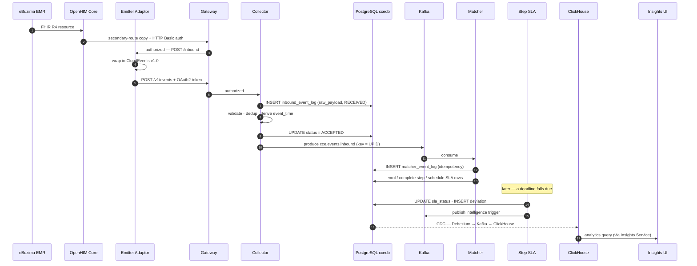

**Traceability keys.** One clinical event can be followed end to end by three keys:

| Key | Spans | Purpose |
|---|---|---|
| `(cloudevents_id, source)` | `inbound_event_log` ↔ `matcher_event_log` | The natural key, unique in both tables — traces an event from the front door to the steps it completed, without a foreign key between them |
| `correlationid` | Every log line, every service | Distributed tracing across services; put into the logging MDC for the life of the event |
| `step_instance.matched_event_id` | `step_instance` → `matcher_event_log` | Links a completed step back to the exact event that completed it |

> **There is no distributed tracing system** (no spans, no OpenTelemetry). Correlation is by MDC field only.

---

## 7. Security

### 7.1 Security posture in one page

| Property | Position |
|---|---|
| **Blast radius on a source system** | **None by design.** CCE never writes to an EMR. A total CCE compromise cannot alter a clinical record in eBuzima. |
| **Blast radius on clinical service delivery** | **None by design.** CCE sits on an OpenHIM *secondary* route, never the primary clinical path. A CCE outage is invisible to clinicians. |
| **Authentication** | OAuth 2.0 / OIDC via Keycloak, for both human users and machine clients |
| **Authorization** | Role-based, enforced at a single gateway against a database-backed permission table |
| **Internal services** | **Unauthenticated at the application layer** — they rely entirely on network isolation and the gateway. See [§7.3](#73-trust-boundaries). |
| **Transport** | HTTPS/TLS at the edge; internal transport TLS is configurable and environment-dependent |
| **Secrets** | Centralised in Infisical; injected at deploy time. No `.env` files. |
| **Patient identifiers** | Pseudonymous programme UPIDs, not names |
| **Known gaps** | Documented honestly in [§7.7](#77-known-gaps-and-hardening-backlog) |

### 7.2 Security architecture

Traffic flows top to bottom. **Every arrow into the platform passes through the gateway** — that is the whole point of the picture.

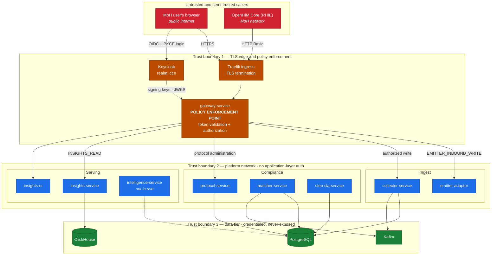

> **Two hops are collapsed in this view.** The emitter's onward call to the Collector **also** crosses the gateway, with its own OAuth2 client credentials — so a single clinical event is authorized twice, under two different identities. Drawing that second hop here would loop an arrow back up into the edge tier; it is set out instead in [§7.4.3](#743-the-openhim-basic-auth-path) and in the container diagram at [§3](#3-c4-level-2--containers).

### 7.3 Trust boundaries

| # | Boundary | What crosses it | Control |
|---|---|---|---|
| **1** | Internet → platform | User dashboard traffic | TLS at Traefik; OIDC login at Keycloak; JWT validated and authorized at the gateway |
| **2** | MoH network → platform | Clinical event stream from OpenHIM | **OpenHIM authenticates to the gateway with HTTP Basic**, which the gateway exchanges for a Keycloak token and authorizes against `EMITTER_INBOUND_WRITE`. The emitter then **authenticates independently** to the gateway with OAuth2 client credentials for its onward call — two separate credentials, deliberately not chained |
| **3** | Gateway → internal services | Authorized requests only | Network isolation. **This is the load-bearing control** — see the note below. |
| **4** | Services → data tier | SQL, Kafka protocol | Per-service database credentials; least-privileged roles for CDC and analytics reads |

> **The load-bearing assumption, stated plainly.** CCE's internal services enforce **no authentication at the application layer**. The Protocol Service documents this explicitly, and so do the Matcher and Step SLA services. The security of the platform therefore rests on network isolation and on the gateway being the *only* route to them.
>
> This is a common and defensible microservice posture, but it has a sharp edge worth naming: **a caller who can reach `POST /v1/protocol/protocol-definitions` directly can change what every patient in the system is measured against.** Network segmentation around the definitional plane is not a nice-to-have.

### 7.4 Authentication and authorization

#### The three things a working user token needs

Access to the dashboard requires all three to line up. Miss any one and the user sees a 401 or 403 *after logging in successfully* — this is by far the most common onboarding failure.

| Requirement | Value | How it is satisfied |
|---|---|---|
| **Issuer** | `https://cce.moh.gov.rw/auth/realms/cce` | Gateway env `JWT_ISSUER` |
| **Audience** | `gateway-service` | Automatic — `gateway-audience` is a *default* client scope on `cce-insights-ui` |
| **Authorization role** | `INSIGHTS_READ` | **Manual** — a client role on `gateway-service`, granted per user |

**How authorization actually works.** The gateway reads roles from `resource_access.gateway-service.roles` and matches them against the `api_permissions` table, which maps `INSIGHTS_READ` → `GET /v1/insights/**`. A user with a perfectly valid token but no `INSIGHTS_READ` role authenticates fine and then gets **403 on every dashboard call**.

#### Machine-to-machine authentication

| Caller | Callee | Mechanism |
|---|---|---|
| eBuzima EMR | OpenHIM Core | OpenHIM channel authentication (MoH-operated, outside CCE) |
| **OpenHIM Core** | **CCE Gateway → Emitter adaptor** | **HTTP Basic.** The gateway exchanges the credentials for a Keycloak token and runs its normal validation pipeline — see [§7.4.3](#743-the-openhim-basic-auth-path) |
| Emitter adaptor | OpenHIM Core API | HTTP Basic, for mediator registration and heartbeat |
| **Emitter adaptor** | **CCE Gateway → Collector** | **OAuth2 client credentials via Keycloak.** Tokens fetched and cached automatically. Falls back to a static bearer token only when Keycloak is not configured. |
| Insights UI | Gateway | User's bearer JWT, forwarded from the browser |
| Services | PostgreSQL / ClickHouse | Per-service credentials from Infisical |

> The emitter authenticates to CCE **independently of** the inbound OpenHIM authentication. These are two separate trust boundaries, deliberately not chained.

#### 7.4.3 The OpenHIM Basic auth path

The inbound clinical stream is the one route where a caller presents HTTP Basic rather than a bearer token, because OpenHIM channels cannot send anything else. It is worth setting out precisely, since "Basic auth" alone reads as a weakness and here it is not.

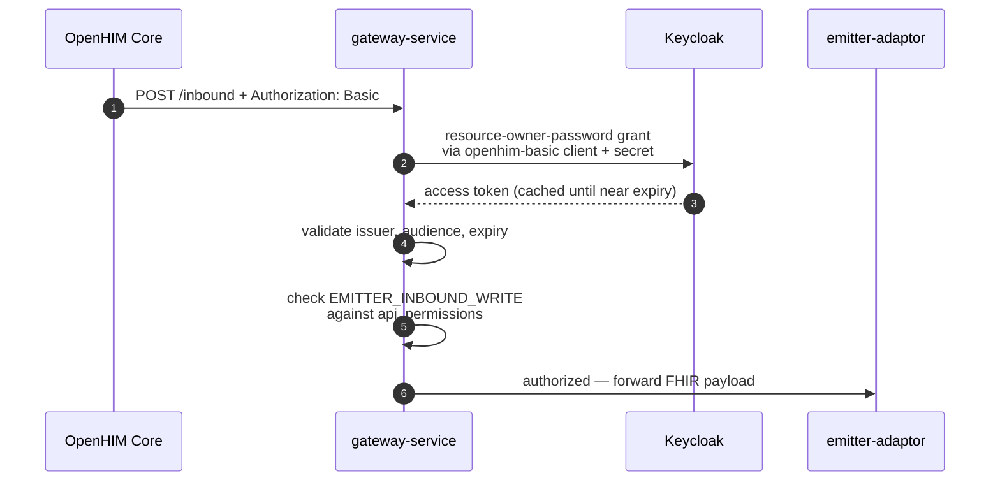

**What makes this acceptable:**

| Property | Detail |
|---|---|
| **Same authorization pipeline** | Once exchanged, the token goes through exactly the same issuer/audience/expiry validation and the same `api_permissions` role check as any bearer caller. Basic is a credential *format* here, not a weaker *path* |
| **Dedicated client** | The exchange uses a confidential client, `openhim-basic`, with Direct Access Grants enabled and Standard Flow and Service Accounts disabled. The bearer-only `gateway-service` client does not enable the password grant at all |
| **Dedicated service account** | The OpenHIM service user holds only `EMITTER_INBOUND_WRITE` — it can post clinical events and nothing else. It cannot read analytics or load protocols |
| **Scoped to one route** | The permission maps to the inbound clinical route alone |
| **Token caching** | Tokens are cached per credential until shortly before expiry, so a high event rate does not translate into a Keycloak request per event |

**What to keep an eye on:**

- The client secret and the service-account password are **real credentials on the clinical ingress path**. They belong in Infisical, in the rotation schedule, and nowhere else.
- The resource-owner-password grant is **deprecated in OAuth 2.1** and treated as legacy by Keycloak. It is the right compatibility bridge today; if OpenHIM ever gains client-credentials support, moving to it removes the last password-grant dependency in the platform.
- Because Basic credentials do not expire on their own, **rotation is the only revocation mechanism.** Confirm the rotation interval as part of [§8.9](#89-deployment-verification-checklist).

#### User onboarding

A single scripted path creates the account, grants `INSIGHTS_READ`, and sends a Keycloak "set your password" email that doubles as first sign-in:

```bash
# Production
sudo -A bash rw/prod/onboard-insights-user.sh \
  --email person@example.org --first-name Ada --last-name Lovelace

# Preview without creating anything or sending email
sudo -A bash rw/prod/onboard-insights-user.sh --email … --dry-run

# Bulk, from CSV: header email,first_name,last_name[,username]
sudo -A bash rw/prod/onboard-insights-user.sh --csv users.csv
```

The wrappers derive the Keycloak URL from **each environment's own secrets**, so they cannot accidentally target the wrong environment, and **no credentials are ever passed on the command line.** Sign-in links are valid 72 hours (tunable via `--lifespan`).

### 7.5 Data protection

| Concern | Control | Status |
|---|---|---|
| **Data in transit — edge** | HTTPS/TLS terminated at Traefik; valid certificate on `cce.moh.gov.rw` | **In place** |
| **Data in transit — emitter → collector** | HTTPS configurable via `server.ssl.*` | Configurable |
| **Data in transit — internal** | ClickHouse TLS, Kafka TLS/SASL "as configured on the platform" | **Environment-dependent — verify per deployment** |
| **Data at rest — PostgreSQL** | Host-level disk encryption | **Deployment responsibility — not enforced by the application** |
| **Data at rest — ClickHouse** | ClickHouse disk encryption; sensitive fields reachable only by authorised roles | Deployment responsibility |
| **Data at rest — backups** | Gzipped dumps on local disk | **Not encrypted at rest by the backup script** |
| **Payload size limit** | 1 MB per event, enforced at the Collector | In place |
| **Least privilege — analytics** | ClickHouse `cce_pipeline` is a **read-only** user; an explicit read-only profile exists | In place |
| **Least privilege — CDC** | Debezium uses a dedicated `cce_cdc_user` PostgreSQL role | In place |
| **Least privilege — insights** | The Insights Service issues no writes at all, by construction | In place |
| **Pseudonymisation** | Patient identifiers are programme UPIDs, not names | In place |
| **Container hardening** | Services run as non-root (`appuser`); multi-stage builds ship a JRE, not a JDK | In place |
| **CSRF** | Disabled on the stateless APIs — correct for token-authenticated, non-cookie services | By design |

### 7.6 Audit and traceability

**What is auditable today:**

| Question | Answer source |
|---|---|
| What did we receive, and when? | `inbound_event_log` — every request, accepted or rejected, with the raw body and both clocks |
| Why was an event rejected? | `inbound_event_log.rejection_reason` + `error_details`, and a Prometheus counter tagged by reason |
| What happened to a patient's care, and in what order? | `protocol_instance_history` + `step_instance_history` — every status transition, append-only |
| Which event completed this step? | `step_instance.matched_event_id` → `matcher_event_log` |
| When did this deadline fall, and when was it applied? | `step_sla_state_transition.process_by` (immutable) and `processed_at` / `processed_by` |
| What intelligence fired, why, and did it reach the broker? | `intelligence_event_log` — evaluated expression, runtime context, published flag, published timestamp |
| Which service instance applied this SLA verdict? | `step_sla_state_transition.processed_by` |

**Logging.** Structured JSON logs in production, with `correlationId` in the MDC for the life of an event, so every line for one event is greppable by a single key. Intelligence evaluation additionally puts `intelligenceEventId` into the MDC.

**What is *not* auditable today:**

- **No actor attribution on definitional changes.** The `audit_log` table was dropped in 2.0.0 and per-row actor columns have not yet landed. Who loaded or retired a protocol is currently recoverable only from application logs.
- **No distributed tracing.** Correlation is by MDC field, not spans.
- **Out-of-band SQL is invisible.** The history tables capture only changes made through the service layer.
- **Log retention is short and can destroy evidence.** In the current Rwanda deployment the emitter's failing heartbeat logs every 10 seconds, which rolls the container log buffer in roughly 13 hours — long enough to lose evidence of an intermittent fault.

### 7.7 Known gaps and hardening backlog

Recorded honestly. None of these is a defect in the sense of "something broke"; each is a decision that has not yet been made or a control that has not yet been added.

| # | Gap | Impact | Recommended action |
|---|---|---|---|
| 1 | **No application-layer auth on internal services** | Anything with network reach to the Protocol Service can rewrite clinical protocols | Enforce network policy around the definitional plane; consider mTLS or service-level tokens |
| 2 | **Default passwords in packaged config** | Several services' `application.yml` files carry default database credentials (`cce_user` / `cce_pass`) | Confirm every deployed service takes its credentials from Infisical; **rotate anything real before wider repository access is granted** |
| 3 | **No actor attribution on protocol changes** | A protocol change cannot be attributed to a person from the database | Add actor columns to the definitional tables |
| 4 | **Backups unencrypted and on the same disk as the data** | Losing the VM loses both the data and its backups | Copy nightly archives off-box; encrypt at rest |
| 5 | **Restores not yet rehearsed** | *A backup you have never restored is a hypothesis* | Restore `ccedb` into UAT as a drill |
| 6 | **Mutable image tags** | A `:latest` tag means you cannot tell from the tag what code is running | Build with immutable version tags; pin digests on production rollouts |
| 7 | **No data-subject erasure path** | Raw payloads persist in PostgreSQL indefinitely, in Kafka for 7 days, and in backups for 10 days | Define an erasure procedure against Rwandan data-protection requirements |
| 8 | **No cold-tier archival** | The 90-day ClickHouse TTL is a hot-tier policy, not a retention policy | Configure archival to object storage with a compliance-driven TTL |
| 9 | **Basic-auth credentials on the clinical ingress path** | OpenHIM authenticates with HTTP Basic over a deprecated OAuth grant. Credentials do not expire on their own, so **rotation is the only revocation mechanism** | Keep the `openhim-basic` client secret and service-account password in Infisical with a defined rotation interval; move to client credentials if OpenHIM ever supports it. See [§7.4.3](#743-the-openhim-basic-auth-path) |
| 10 | **No ingestion-freshness alert** | CCE is a passive observer, so a silent upstream stop is indistinguishable from a quiet clinical period | Alert on *"no new rows in `inbound_event_log` for N hours"* — see [§8.5](#85-monitoring) |
| 11 | **Internal transport TLS is environment-dependent** | Kafka and ClickHouse TLS are "as configured on the platform" | Verify and document the actual setting for this deployment |
| 12 | **No OpenAPI specifications** | API contracts are Markdown, so they cannot be linted, mocked or contract-tested | Generate OpenAPI from the controllers |

---

## 8. Rwanda production deployment

This section describes the CCE 2.0.0 deployment for the Rwanda Ministry of Health — the environment it runs in, the services that make it up, and how it is operated.

### 8.1 Deployment diagram

Arrows follow the **direction of the request**, top to bottom. The Kafka broker appears three times, once per topic family it carries — it is one broker on one port.

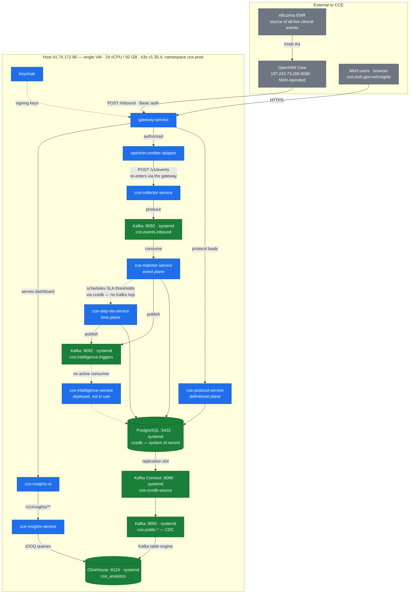

**Legend** — **Blue**: pod in k3s (`cce-prod`) · **Green**: native `systemd` service on the host, **not** in Kubernetes · **Grey**: external to CCE.

> **Two things this diagram makes explicit.**
>
> **Kubernetes is only half the system.** PostgreSQL, Kafka, Kafka Connect and ClickHouse are installed **natively via systemd on the host**, not inside Kubernetes. Restarting a pod will never fix a database problem, and `kubectl` will not show you these services — use `systemctl`.
>
> **Two write paths, one source of truth.** PostgreSQL `ccedb` is authoritative. ClickHouse `cce_analytics` is a derived mirror rebuilt from PostgreSQL by CDC. If analytics look wrong, the fix is to rebuild the mirror — never to edit ClickHouse by hand.

### 8.2 Environments and hosts

Both environments run on a **single physical VM**, sharing one k3s cluster with one namespace each. This is the single most surprising fact about the deployment and it drives several of the quirks below.

| | |
|---|---|
| **Host** | `41.74.172.80` |
| **Hostname** | `cce-uat` — **misleading; this host runs production too** |
| **Capacity** | 24 vCPU · 92 GB RAM · 736 GB disk (32% used) |
| **Kubernetes** | k3s v1.35.4, single node, Traefik ingress |

> **Expect this to confuse people.** The machine's hostname is `cce-uat`, and `kubectl get pods -o wide` reports the node as `cce-uat` for *production* pods too. This is cosmetic — it is one shared node — but it has repeatedly caused people to think they were on the wrong box. **Always confirm which environment you are touching by namespace (`cce-prod` vs `cce-uat`), never by hostname.**

#### Environment comparison

| | **Production** | **UAT** |
|---|---|---|
| Public URL | `cce.moh.gov.rw` | `cceuat.moh.gov.rw` |
| Namespace | `cce-prod` | `cce-uat` |
| Infrastructure | Native systemd | Docker containers |
| PostgreSQL | `:5432` | `:5433` |
| ClickHouse HTTP | `:8124` | `:8123` |
| ClickHouse native | `:9001` | `:9000` |
| ClickHouse metrics | `:9364` | `:9363` |
| Kafka Connect REST | `:8086` | `:8083` |
| Autoscaling (HPA) | Yes — 8 HPAs | No |
| Resource quota | 20 CPU / 28 Gi requests | 10 CPU limit |

> **Why production ports are shifted.** Because both environments share one host, production's native services would collide with UAT's Docker containers on the standard ports. Production therefore uses shifted ports (`8124`, `9001`, `9010`, `9364`, `8086`) while UAT keeps the defaults. **If CCE is ever installed on a dedicated machine the shift is unnecessary** — `rw/one-click-install.sh` handles that case and uses standard ports.

#### Reaching the server

```bash
ssh cceadmin@41.74.172.80
```

Credentials are in `rw/docs/ACCESS-CREDENTIALS.md`.

> **A sudo gotcha that will bite you.** Environment variables must come **after** `sudo`, because sudo resets the environment. `DRY_RUN=1 sudo bash script.sh` silently drops the variable and **runs for real**. Use `sudo -A env DRY_RUN=1 bash script.sh` instead. Every redeploy script repeats this warning in its header for good reason.

### 8.3 Services in the deployment

Nine CCE application deployments, plus the supporting stack.

#### CCE application services

| Service | Default port | Replicas | Scales with | Notes |
|---|---|---|---|---|
| `openhim-emitter-adaptor` | 8082 | 2 (2–3) | Inbound volume | Stateless — holds no data at all |
| `cce-collector-service` | 8080 | 2 (2–3) | Inbound volume | Owns `inbound_event_log` |
| `cce-protocol-service` | 8090 (8080 in-container) | 1 | Not throughput-bound | Protocol loads only — a second replica buys availability, not throughput. 512 MB heap is ample. Needs DDL rights |
| `cce-matcher-service` | 8091 (8080 in-container) | 2–3 | **Kafka partitions** (25) | No REST API — Kafka-driven. 2 GB heap and 4 cores recommended. Needs DDL rights |
| `cce-step-sla-service` | 8092 (8080 in-container) | 2–3 | **Backlog**, not traffic | Creates no tables and needs **no DDL rights**. Extra replicas add throughput directly — no leader election, no lease |
| `cce-intelligence-service` | 8085 | 1 | — | **Deployed but not in use.** Integration planned for a later phase — see [§8.8](#88-known-items) |
| `cce-insights-service` | 8084 | 1 (1–3) | Query load | Read-only analytics API |
| `cce-insights-ui` | 3001 | 1 (1–3) | Query load | Static SPA |
| `gateway-service` | 8090 | 2 (2–3) | Request volume | The only externally reachable service |

#### Supporting services

| Service | Port | Image |
|---|---|---|
| `keycloak` — identity provider | 8080 | `quay.io/keycloak/keycloak:26.5.4` |
| `prometheus` — metrics | 9090 | `prom/prometheus:v2.51.2` |
| `grafana` — dashboards | 3000 | `grafana/grafana:10.4.2` |
| `kafka-ui` — topic inspection | 8080 | `provectuslabs/kafka-ui:v0.7.2` |
| `node-exporter` — host metrics | 9100 | `prom/node-exporter` |

#### Deployment order — Protocol → Matcher → Step SLA

**This is not a preference.** The Matcher Service's migration declares foreign keys into tables the Protocol Service creates, and the Step SLA Service validates its JPA mapping at startup under `ddl-auto: validate` — it will **fail fast** rather than start against a schema that cannot serve it. That is how an ordering mistake surfaces immediately rather than as a runtime error hours later.

| Order | Service | Schema role |
|---|---|---|
| 1 | `cce-protocol-service` | Runs Flyway; creates `protocol_definition`, `action_definition`, `trigger_index`. Ledger: `flyway_schema_history_protocol` |
| 2 | `cce-matcher-service` | Runs Flyway; creates the runtime-plane tables. Ledger: `flyway_schema_history_matcher` |
| 3 | `cce-step-sla-service` | Creates nothing. Flyway disabled; validates and fails fast |

The Collector Service owns `inbound_event_log` and migrates independently of the three.

#### Event Replay — the other sequence, and this one is a runtime one

**Stop `cce-step-sla-service` while `cce-matcher-service` still has an event backlog to process, and start it again only once that backlog is drained.** The SLA service decides that work has not happened by finding no completion on `step_instance`, which is only sound once every event that could have completed the step has been matched. Run it against an unmatched backlog and it records `OVERDUE` and `MISSED` against steps whose completing event is still queued — and none of it can be withdrawn, because SLA writes are forward-only, the deviation is de-duplicated, and **the intelligence event has already been published: a clinician has already been alerted.**

**Event Replay** is the term for any such run — events re-published after a fix, a historical backfill during migration, or a long outage that left the consumer group far behind. Replaying historical events makes wrong verdicts the default rather than a race, because SLA thresholds are anchored to *clinical* time: a step created from a month-old event is scheduled with its deadline already in the past, so it is judged within seconds — long before the completing event, later in the same backlog, is matched.

Holding the SLA service off costs only detection latency. Its judgement never consults the wall clock, so a row applied days late reaches exactly the verdict it would have reached on time. Unlike the deployment order above, this sequence **fails silently** — there is no fail-fast to catch it, only the wrong data afterwards. Runbook: `cce-step-sla-service` → `docs/deployment-guide.md`.

#### Image tagging

> **Use immutable version tags and record the digests at deployment.** A mutable tag such as `:latest` means a rollout restart pulls whatever is in the registry at that moment, and **you cannot tell from the tag what code is running.** Pin explicitly on every production rollout:
>
> ```bash
> sudo -A env IMAGE_DIGEST=sha256:<digest> bash rw/prod/redeploy.sh <service>
> ```

#### A naming point worth settling

This service answers to two names, and the split is not where you would guess. The deployed artifact is coherently **`cce-compliance-service`** — it is only the documentation, this document included, that still calls it `cce-step-sla-service`.

| Where | Name today |
|---|---|
| Code repository | `cce-compliance-service` |
| Spring `spring.application.name`, Kubernetes manifest, image tag | `cce-compliance-service` |
| Java package | `org.openphc.cce.compliance` |
| Read API route prefix | `/v1/compliance/**` |
| Its own README and `docs/` titles | "CCE Compliance Service" |
| **Documentation-only mirror repository** | **`cce-step-sla-service`** |
| **Config and metric namespace** (`cce.sla.*`, `CCE_SLA_*`) | **`sla`** |
| **This document, §3 / §4.4 / §8 / Appendix A** | **`cce-step-sla-service`** |

So there is nothing to fix in the running service: the manifest, the app name and the route prefix already agree. What is unsettled is which name the *documentation and operations surface* should use — this document, the mirror repository, the Grafana dashboards keyed on `cce.sla.*`, and the runbooks.

**Agree one name before rollout.** Renaming the metric namespace is the expensive half, because dashboards and alert rules are keyed on `cce.sla.*`; renaming documentation is cheap. Either decision is fine, but a service with two names in the runbooks is how an incident goes wrong at 3am. Until it is settled, read `cce-step-sla-service` and `cce-compliance-service` in these documents as the same service.

### 8.4 Data stores in production

| Store | Role | Indicative size | Access |
|---|---|---|---|
| **PostgreSQL `ccedb`** | **System of record** — all compliance state | ~1.5 GB | `sudo -A -u postgres psql -p 5432 -d ccedb` |
| **PostgreSQL `keycloak`** | Identity — users, realms, clients, roles | ~13 MB | Same server, port 5432 |
| **ClickHouse `cce_analytics`** | **Derived mirror** — denormalised analytics tables and MVs | ~310 MiB | HTTP on `:8124`, user `cce_pipeline` |

| CDC component | Identity |
|---|---|
| Replication slot | `cce_analytics_slot` |
| Publication | `cce_analytics_pub` |
| Debezium connector | `cce-ccedb-source`, Kafka Connect REST on `:8086` |

> **Watch the replication slot — the single most dangerous silent failure in the platform.** If the Debezium connector stops while PostgreSQL keeps writing, the replication slot retains WAL indefinitely and **will eventually fill the disk**. Check it regularly:
>
> ```bash
> sudo -A -u postgres psql -p 5432 -tAc \
>   "SELECT slot_name, active,
>           pg_size_pretty(pg_wal_lsn_diff(pg_current_wal_lsn(), restart_lsn))
>    FROM pg_replication_slots;"
> ```

#### Rebuilding the analytics mirror

Deletes in PostgreSQL propagate to ClickHouse via CDC, but **schema changes and aggregate corrections do not.** When analytics diverge from the source, rebuild rather than patch:

```bash
# Full rebuild + re-snapshot (long-running; supports resume)
sudo -A bash rw/prod/replay-prod.sh

# Resume from a given step after an interruption
sudo -A env START_STEP=8 bash rw/prod/replay-prod.sh
```

> **Known behaviour of replay.** The "wait for re-snapshot to stabilise" step compares row counts until they stop changing. Under live production traffic they never stop changing, so **this step will time out. That is expected** — let it time out and continue, or run the remaining steps manually. Aggregate tables built with `SummingMergeTree` can also over-count if source rows are bulk-updated; `rebuild-inbound-mvs.sh` exists for exactly that repair.

> **A re-snapshot loses historical daily-summary rows** unless backfilled. The `*_history` tables exist precisely so `schema/09-historical-backfill.sql` can rebuild those days — **run it after any full rebuild** or the dashboard's historical trend lines start from the rebuild date.

### 8.5 Monitoring

Prometheus scrapes the services and host exporters; Grafana renders them. Both are reachable through the production ingress.

| Endpoint | Path | Purpose |
|---|---|---|
| Grafana | `cce.moh.gov.rw/grafana` | Dashboards |
| Kafka UI | `/kafka-ui` | Topic and consumer-group inspection |
| Portainer | `:9000` | Container management (UAT Docker stack) |

**Dashboards:** per-service throughput/latency/JVM/error-rate boards; a **CCE Pipeline Health** end-to-end ingestion view; and infrastructure boards for Host, PostgreSQL, Kafka, ClickHouse Query Analytics and PostgreSQL Query Analytics.

**Host exporters:** `node-exporter` :9100 (CPU, memory, disk, network) · `postgres_exporter` :9187 (connections, replication lag, table stats) · `kafka_exporter` :9308 (topic offsets, consumer-group lag) · ClickHouse built-in :9364 (query performance, merges, parts).

#### Signals worth watching

| Signal | Why it matters |
|---|---|
| `cce.sla.transitions.due` (gauge) | **The key scaling signal for the Step SLA Service.** Scale on this rather than CPU — the service is database-bound, and a backlog shows up here long before it shows as CPU pressure |
| `cce.events.matched` (counter, tagged `matched` / `zero_match`) | Whether events are finding protocols at all. A rising `zero_match` share usually means a protocol or trigger problem, not an infrastructure one |
| `cce.events.processing.duration` (timer) | End-to-end matcher latency |
| `cce.intelligence.actions.fired` (counter) | Whether intelligence is firing as expected |
| `cce.clinical_time.unmapped` / `.unparseable` (counters, tagged by resource type) | Data-quality signal — events whose clinical time could not be resolved and fell back to envelope time |
| Consumer-group lag on `cce.events.inbound` | The Matcher's parallelism ceiling is the partition count (25) |
| Replication slot retained WAL | The disk-fill risk described in [§8.4](#84-data-stores-in-production) |
| Freshness of `inbound_event_log` | See the recommendation below |

> **Grafana timezone.** Dashboards render in the *viewer's* browser timezone while all server timestamps are UTC. A panel reading 18:22 may correspond to 12:52 UTC in the database. **Always reconcile against UTC before concluding an event did or did not happen.**

> **Recommended addition: an ingestion-freshness alert.** Nothing currently alerts on *"no new rows in `inbound_event_log` for N hours"*. Because CCE is a passive observer, a silent upstream stop looks exactly like a quiet clinical period — the platform has no way to tell the difference on its own. This is the single highest-value monitoring rule to add.

### 8.6 Backups and recovery

| | |
|---|---|
| **Schedule** | 02:00 daily, root crontab |
| **Location** | `/var/backups/cce-prod` — one dated folder per run |
| **Retention** | 10 days (~5.8 GB on disk) |

| Artifact | Typical size |
|---|---|
| `pg-ccedb-<stamp>.sql.gz` | 187 MB |
| `pg-keycloak-<stamp>.sql.gz` | 68 KB |
| `clickhouse-cce_analytics-<stamp>.sql.gz` | 349 MB |

```bash
# Confirm last night's run succeeded
sudo tail -20 /var/backups/cce-prod/cron.log

# List what is retained
sudo ls -lh /var/backups/cce-prod/
```

> **Two risks to accept or fix.**
>
> **Backups are on the same disk as the data.** Losing the VM loses both. Copying the nightly archive off-box is the single most valuable resilience improvement available.
>
> **Restores should be rehearsed.** *A backup you have never restored is a hypothesis.* Restoring production `ccedb` into UAT proves the backup and exercises the recovery procedure in one exercise. The procedure is in `rw/docs/BACKUP-RESTORE.md` §4–5; full-rebuild scenarios are in `DISASTER-RECOVERY.md`.

**ClickHouse does not strictly need backing up** — it can be fully reconstructed from PostgreSQL via `replay-prod.sh`. The dump exists to make recovery *faster*, not to make it *possible*. **PostgreSQL and Keycloak dumps are irreplaceable.**

### 8.7 Routine operations

Everything Rwanda-specific — install, redeploy, backup, replay, troubleshoot — lives in `/home/cceadmin/deploy-scripts/rw/` on the server, with a **13-file operations handbook** in `rw/docs/`.

> **Read this first.** `rw/docs/00-README.md` indexes a complete operations handbook. This document points into it rather than repeating it. If you read nothing else, read `OPERATIONS-RUNBOOK.md` and `TROUBLESHOOTING.md`.

#### Daily health check

```bash
cd /home/cceadmin/deploy-scripts
sudo -A bash rw/prod/health-check.sh
```

Covers pods, systemd units, HTTPS reachability, the replication slot and the Debezium connector, and **exits non-zero on failure** — so it can be wired into cron or an alert.

#### Ingestion freshness — the check to run most often

```bash
sudo -A -u postgres psql -p 5432 -d ccedb -tAc \
  "SELECT max(received_at),
          count(*) FILTER (WHERE received_at > now() - interval '24 hours')
   FROM inbound_event_log;"
```

If `max(received_at)` is not recent, events have stopped arriving — **begin with the emitter adaptor logs and OpenHIM, not with CCE's internals.**

#### SLA backlog

```bash
sudo -A -u postgres psql -p 5432 -d ccedb -tAc \
  "SELECT count(*) FROM step_sla_state_transition
   WHERE is_processed = false AND next_attempt_at < now();"
```

A number that grows steadily means the Step SLA Service is not keeping up — add a replica. A number that grows *and* whose rows carry a high `attempts` count means transitions are failing rather than merely queuing.

A large number straight after an [Event Replay](#event-replay--the-other-sequence-and-this-one-is-a-runtime-one) is expected and not a fault: every deadline that fell while the service was stopped comes due at once, and batches drain within a cycle.

#### Unpublished intelligence

```bash
curl -s "https://cce.moh.gov.rw/v1/compliance/intelligence-events?published=false"
```

Lists intelligence that was evaluated and should have been delivered but was never acknowledged by the broker. These rows are the replay candidates.

#### Deploying a service

```bash
# Config change, or a new image on the tag
sudo -A bash rw/prod/redeploy.sh cce-insights-service

# Pin an exact build (recommended for production)
sudo -A env IMAGE_DIGEST=sha256:<digest> bash rw/prod/redeploy.sh cce-insights-service

# Preview only — note env vars go AFTER sudo
sudo -A env DRY_RUN=1 bash rw/prod/redeploy.sh cce-insights-service
```

> **Recommended promotion path.** Deploy to UAT, verify, then promote **the exact digest that was verified** to production — not the tag:
>
> ```bash
> sudo -A k3s kubectl -n cce-uat get deploy <svc> \
>   -o jsonpath='{.spec.template.spec.containers[0].image}'
> ```

**What redeploy does and does not do:**

- **Does:** re-pull config and secrets from Infisical, re-apply the `cce-config` ConfigMap and `cce-secrets` Secret, then roll the pods.
- **Does not:** re-apply Deployment manifest *structure*. If you change the shape of a Deployment in `k8s/base/` (adding an env var, changing a probe), **a redeploy will not pick it up** — you must render and apply that Deployment specifically.

> **UAT rollouts stall — this is normal.** UAT sits near its CPU quota ceiling, so rolling updates that need room for both old and new pods fail with `exceeded quota` and time out after ~3 minutes. The redeploy script detects this and automatically falls back to scaling to 0 then back to 1. **Let it run.** Production has ample headroom and does not hit this.

#### Inspecting the system

```bash
# Pods and images
sudo -A k3s kubectl -n cce-prod get pods
sudo -A k3s kubectl -n cce-prod get deploy \
  -o custom-columns='NAME:.metadata.name,IMAGE:.spec.template.spec.containers[0].image'

# Logs
sudo -A k3s kubectl -n cce-prod logs deploy/<service> --since=1h

# Native infrastructure — NOT visible to kubectl
sudo systemctl status postgresql@16-main kafka kafka-connect clickhouse-server

# Run anything with an environment's secrets injected
sudo -A bash rw/lib/infisical-run.sh prod bash -c 'echo $KEYCLOAK_ISSUER'
```

#### Secrets and configuration

All configuration and secrets are centralised in **Infisical** and injected at deploy time — `rw/lib/infisical-run.sh <prod|uat> <command>` runs any command with that environment's secrets in scope. **This replaced all `.env` files.** Off-box recovery material lives in `rw/bkp/`.

**Configuration variables that matter in production:**

| Variable | Service | Note |
|---|---|---|
| `DB_USERNAME` / `DB_PASSWORD` | All | **Never leave at the packaged defaults** (`cce_user` / `cce_pass`) |
| `CCE_FLYWAY_BASELINE_VERSION` | Protocol, Matcher | `0` for a new database. Leaving it non-zero would make a future fresh deployment skip schema creation entirely |
| `CCE_SLA_INSTANCE_ID` | Step SLA | Defaults to `$HOSTNAME`, already distinct per pod in Kubernetes. It lands in `processed_by`, so without a unique value you cannot identify a misbehaving replica |
| `CCE_SLA_POLL_INTERVAL_MS` | Step SLA | Default `5000` |
| `CCE_SLA_BATCH_SIZE` | Step SLA | Default `100` — trades transaction length against round trips |
| `KAFKA_BOOTSTRAP_SERVERS` | Collector, Matcher, Step SLA, Intelligence | |
| `JWT_ISSUER` | Gateway | Must match the Keycloak realm issuer exactly |

> **Do not edit these.** Several repositories contain **stale build output committed to git** — `bin/main/application*.yml` in `cce-insights-service`, `cce-intelligence-service` and `openhim-cce-emitter-adaptor`. Editing those has no effect. The live config is under `src/main/resources/` — and in practice is overridden by Infisical anyway.

### 8.8 Known items

> #### 🟡 Facility attribution is incomplete by design of the source
>
> Roughly **40% of analytics events carry no facility** and appear as "Unassigned" in facility rankings. **This is not a CCE defect.** eBuzima does not attach any facility reference to certain FHIR resource types — vitals, BMI, allergies, chief complaints, diagnoses, lab results and a small share of medication requests all arrive with no `source-facility` extension, no `Encounter.location` and no facility field at all. Encounters and service requests *do* carry it. Closing this gap requires a change on the eBuzima side.

> #### 🟡 Intelligence delivery is not in use
>
> **`cce-intelligence-service` is deployed but not in use.** No receiver adaptors are integrated with any Rwandan target system, and integration is planned for a later phase rather than scheduled now.
>
> **What this does and does not mean.** CCE still *detects* everything it is designed to detect — deviations are recorded, and where a protocol defines intelligence actions the compliance services evaluate them and write `intelligence_event_log`. What does not happen is **delivery**: no alert, task or escalation reaches an external system. Intelligence is therefore visible in the database and in analytics, but it does not act on anyone.
>
> **Practical consequences today:**
> - `intelligence_delivery`, `receiver_adaptor` and `destination_adaptor_mapping` are **empty or unused**, in PostgreSQL and in their ClickHouse mirrors alike. Analytics built on delivery status will show nothing.
> - The service's pod consumes resource without doing work. It can be scaled to zero if that resource is needed, provided the deployment is retained for the later phase.
> - **Compliance tracking, deviation detection and the analytics dashboard are entirely unaffected** — they are what the deployment delivers today.

#### Housekeeping backlog

- **Immutable image tags and digest pinning** for production rollouts ([§8.3](#83-services-in-the-deployment)).
- **Default passwords** in several services' packaged `application.yml` files. **Rotate anything real before wider repository access is granted.**
- **Backups are on-box only and unencrypted** ([§8.6](#86-backups-and-recovery)).
- **No ingestion-freshness alert** ([§8.5](#85-monitoring)).
- **Retention policy undecided** — see [§6.7](#67-data-retention-and-lifecycle).

### 8.9 Deployment verification checklist

Each item is verifiable — you should be able to demonstrate it rather than assume it.

**Access**

- [ ] SSH to `41.74.172.80` using your own credentials
- [ ] Log in to the Keycloak admin console and switch to the `cce` realm
- [ ] Open Grafana and confirm the CCE dashboards render
- [ ] Read a secret from Infisical for both `prod` and `uat`
- [ ] Confirm access to the GitHub organisation and the image registry

**Platform health**

- [ ] `rw/prod/health-check.sh` runs clean, and you can interpret every line of its output
- [ ] All nine CCE deployments are `Ready` in `cce-prod`
- [ ] Native services up: `postgresql@16-main`, `kafka`, `kafka-connect`, `clickhouse-server`
- [ ] Replication slot active and not accumulating WAL
- [ ] Debezium connector `cce-ccedb-source` in `RUNNING` state

**Function**

- [ ] Load a FHIR PlanDefinition through `cce-protocol-service` and confirm `trigger_index` rows appear
- [ ] Trace a test clinical event from OpenHIM through to a `step_instance` row
- [ ] Confirm an SLA threshold fires: a step past its due date reaches `sla_status = OVERDUE` with a matching `deviation` row
- [ ] SLA backlog query returns a stable number ([§8.7](#87-routine-operations))
- [ ] Onboard a test user end to end — email arrives, dashboard loads **without a 403**
- [ ] Dashboard renders with historical trend lines intact

**Operations**

- [ ] Run a redeploy in UAT with `DRY_RUN=1`, then for real
- [ ] Promote a specific digest from UAT to production
- [ ] Locate last night's backup and confirm it completed
- [ ] Restore `ccedb` into UAT to prove the backup is real

**Agree with the delivery team**

- [ ] Who owns the OpenHIM/eBuzima integration contact point
- [ ] Escalation path and expected response times
- [ ] Where secrets are rotated, and on what schedule
- [ ] Whether backups move off-box, and who does it
- [ ] A date for the first restore drill
- [ ] The data-retention policy ([§6.7](#67-data-retention-and-lifecycle))

## Appendix A — Source repositories and documentation

Every service carries its own `docs/` folder with a consistent structure. To understand a service in depth, start with its `architecture-overview.md`, then `api-reference.md`.

> **Documentation convention.** Most repositories follow the same six-file pattern: `architecture-overview.md` · `api-reference.md` · `data-dictionary.md` · `deployment-guide.md` · `developer-setup.md` · `flow-diagrams.md`. Services that use Kafka add `kafka-events.md` carrying the CloudEvents contracts.

| Repository | Stack | Notable documentation |
|---|---|---|
| `cce-common-util` | Shared Java library | **`docs/architecture-overview.md` is the best system-level starting point**; `data-dictionary.md` is the canonical shared schema |
| `openhim-cce-emitter-adaptor` | Spring Boot 3.4.1, Java 21, Gradle KTS | Full set plus `openhim-channel-setup.md`, `monitoring-alerting.md`. Also `postman/`, `wiremock/`, `load-test/` |
| `cce-collector-service` | Spring Boot 3.4.1, Postgres, Kafka, Flyway | Full set plus `operations-runbook.md`, `kafka-events.md`. Migrations in `src/main/resources/db/migration/` |
| `cce-protocol-service` | Spring Boot 3.4.2, Java 21 | `api-reference.md`, `architecture-overview.md`, `deployment-guide.md`, `developer-setup.md` |
| `cce-matcher-service` | Spring Boot 3.4.2, Java 21 | Full set plus `kafka-events.md`, `sample-plan-definition.md` |
| `cce-compliance-service`<br/>*(this document calls it `cce-step-sla-service` — [§8.3](#a-naming-point-worth-settling))* | Spring Boot 3.4.2, Java 21, Postgres (no Flyway), Kafka produce-only. Scheduled `FOR UPDATE SKIP LOCKED` sweep — **no leader election** ([§4.4](#44-cce-step-sla-service--the-time-plane)) | `api-reference.md`, `architecture-overview.md`, `deployment-guide.md`, `developer-setup.md` — carried identically in the `cce-step-sla-service` mirror |
| `cce-intelligence-service` | Spring Boot 3.4.5, Kafka, Flyway | Full set plus `insights-optimization.md` |
| `cce-insights-service` | Spring Boot 3.4.4, jOOQ → ClickHouse | Full set. `RELEASE_NOTES.md`, `.env.example` |
| `cce-insights-ui` | React 18 + TS, Vite 6, Tailwind 4 | `api-integration.md`, `deployment-guide.md`, `pages-and-wireframes.md`, `developer-setup.md` |
| `gateway-service` | Spring Boot 3.5.6, Spring Cloud Gateway | **No `docs/` folder.** See `README.md`, `DATABASE_PERMISSIONS_MIGRATION.md`, `scripts/README.md` |
| `cce-data-pipeline` | ClickHouse + Debezium, SQL & shell | `docs/index.md`, `architecture-overview.md`, `data-flow.md`, `deployment-guide.md`. DDL in `schema/01..09-*.sql` |

**Documentation-only repositories:**

| Repository | Contains |
|---|---|
| `cce-compliance-sub_system` | Consolidated doc mirror of every service, plus `artifacts/CCE_Solution_Design.md`, `RHIE_Documentation-2025.md`, and the eBuzima navigation guide. *Snapshots — may lag the live repos.* |
| `cce-step-sla-service` | Documentation mirror of `cce-compliance-service` — same four files, no code. See [§8.3](#a-naming-point-worth-settling) |
| `cce-test-suite` | Platform test strategy: test plan, E2E scenarios, performance and security plans, traceability matrix, per-repo test specs |
| `cce-admin-service` / `cce-admin-ui` | Design docs for a planned admin plane. Not built, not deployed. |

### The `rw/` operations handbook

| File | Covers |
|---|---|
| `00-README.md` | Index and "where to start" guide |
| `ARCHITECTURE.md` | Host layout, two namespaces on one k3s, port map, data flow, DNS/TLS |
| `ACCESS-CREDENTIALS.md` | **SENSITIVE** — SSH, Portainer, Infisical and Keycloak credentials |
| `OPERATIONS-RUNBOOK.md` | Health checks, logs, restarts, deployments, common tasks |
| `TROUBLESHOOTING.md` | Known failure modes and their fixes — **the highest-value file here** |
| `BACKUP-RESTORE.md` | Daily backup mechanics, PostgreSQL and ClickHouse restore procedures |
| `DISASTER-RECOVERY.md` | Scenarios A–D, including full host rebuild |
| `MONITORING-ALERTING.md` | Prometheus/Grafana setup, exporters, what to alert on |
| `ENVIRONMENT-VARIABLES.md` | Catalogue of every Infisical variable and what consumes it |
| `MAINTENANCE.md` | TLS renewal, WAL/replication slot care, retention, OS patching |
| `SECURITY.md` | Credential rotation, firewall, rate limits |
| `SCALING.md` | Resource footprint, HPA behaviour, VM sizing guidance |

---

## Appendix B — Glossary

| Term | Meaning |
|---|---|
| **CloudEvents** | CNCF specification for a standard event envelope. Every inbound clinical event is wrapped in one. |
| **FHIR R4** | HL7 Fast Healthcare Interoperability Resources, release 4 — the clinical payload format. |
| **PlanDefinition** | The FHIR resource CCE uses to express a care protocol: its actions, triggers, timing and ordering. |
| **ActivityDefinition** | The FHIR resource describing what an intelligence action *does* — a notification, a task, a referral. |
| **UPID** | Unique Patient Identifier — the pseudonymous programme identifier carried as the CloudEvent `subject`. |
| **Protocol instance** | One patient's enrolment in one protocol. |
| **Step instance** | One occurrence of one protocol action for one patient. |
| **Deviation** | A recorded departure from the protocol: `OVERDUE`, `MISSED`, or `ORDER_VIOLATION`. |
| **SLA threshold** | A deadline a step can cross — its due date, or its missed date (due date + tolerance days). |
| **Intelligence event** | An advisory event CCE publishes when a rule fires. CCE never acts on it itself. |
| **Trigger index** | An inverted index built at protocol-load time so events can be matched with one indexed lookup. |
| **CDC** | Change Data Capture — streaming PostgreSQL's write-ahead log into the analytics mirror. |
| **Replication slot** | The PostgreSQL object that tracks how far CDC has consumed. **If it stalls, WAL accumulates until the disk fills.** |
| **Materialized view (MV)** | A ClickHouse pre-aggregation maintained at insert time. |
| **`FINAL`** | The ClickHouse modifier forcing row deduplication at query time. |
| **Emitter adaptor** | The mediator that converts a source system's FHIR into CloudEvents for CCE. |
| **Receiver adaptor** | The component that converts a CCE intelligence event into a target system's record. Planned for a later phase; **none is integrated today**. |
| **Event Replay** | Any run where the Matcher Service has an event backlog to work through — events re-published after a fix, a historical backfill, or a long outage. The Step SLA Service **must be stopped** for the duration, or it records deviations against steps whose completing event has not been matched yet. See §8.3. |
| **Infisical** | The secrets manager holding all environment configuration. It replaced `.env` files. |

---

## Appendix C — Sources and verification status

This document was assembled from the following sources. Statements are traceable to them.

| Source | Ref used | Status |
|---|---|---|
| `cce-common-util/docs` | `release-2.0.0` | Current |
| `openhim-cce-emitter-adaptor/docs` | `release-1.0.0` | Current |
| `cce-collector-service/docs` | `release-2.0.0` | Current |
| `cce-protocol-service/docs` | `release-2.0.0` | Current |
| `cce-matcher-service/docs` | `release-2.0.0` | Current |
| `cce-step-sla-service/docs` | `release-2.0.0` | Current |
| `cce-data-pipeline/docs` | **`demo`** | See note below |
| `cce-insights-service/docs` | **`demo-rw`** | See note below |
| `cce-insights-ui/docs` | **`demo-rw`** | See note below |
| `gateway-service` | `main` (`README.md`, `DATABASE_PERMISSIONS_MIGRATION.md`) | No `docs/` folder exists |
| *CCE Rwanda Handover*, 2026-08-19 | — | Verified live against `cce-prod` on that date |

> **Branch note.** The `release-1.0.0` branches of `cce-data-pipeline`, `cce-insights-service` and `cce-insights-ui` contain **only a README — no `docs/` directory**. Their documentation lives on `demo` and `demo-rw` respectively, which are also the branches whose images (`demo-rw-latest`) are deployed in Rwanda. Those branches were therefore used. If `release-1.0.0` is intended to be the customer-facing tag for these three repositories, the documentation needs to be merged onto it.

### Known documentation drift

Two inconsistencies are worth flagging rather than silently reconciling:

| Item | Drift | Which to trust |
|---|---|---|
| **Analytics tier schema** | The `cce-data-pipeline` and `cce-insights-service` documentation still describes an earlier `step_instance` shape (`state`, `completion_status`, `overdue_date`, `missed_date`). Release 2.0.0 uses the `step_status` / `sla_status` pair described in [§4.5](#45-the-two-status-model--the-heart-of-the-data-model) | **§4.5 and §6.3** are authoritative for the 2.0.0 data model |
| **Service ports** | The gateway is documented as `:8081` in its README and `:8060` in the UI docs, and runs on `:8090` in Rwanda; the collector appears as both `:8080` and `:8081` | **§8.3** is authoritative for the deployment |
| **The time-plane service's name** | The code, manifest, app name and API route all say `cce-compliance-service`; this document, the `cce-step-sla-service` mirror repository and the `cce.sla.*` metric namespace say otherwise. The same four doc files are maintained in both repositories | **`cce-compliance-service`** is the deployed artifact; see [§8.3](#a-naming-point-worth-settling) for what is still to be decided |

---

*Prepared for the OpenPHC Care Coordination Engine customer technical review. Architecture and data-model content is drawn from the service repositories at the references listed in Appendix C; all deployment facts, image digests, sizes and status in §8 were verified live against `cce-prod` on 2026-08-19.*
